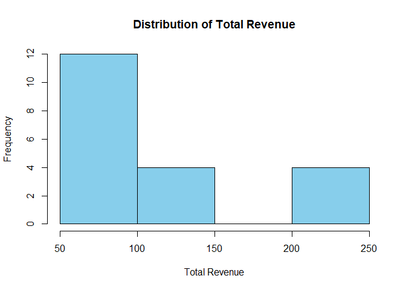
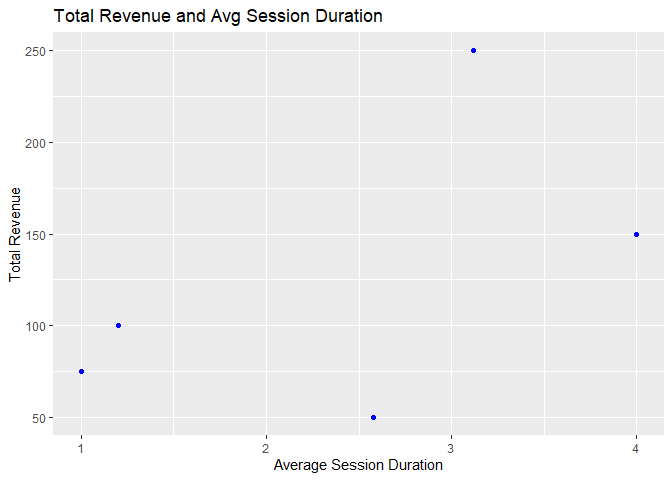
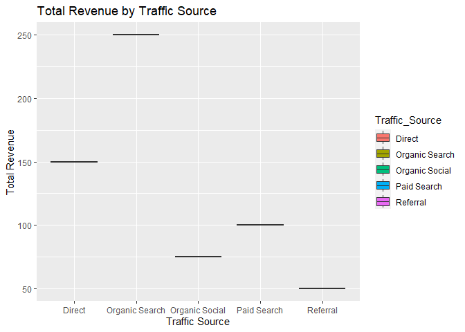
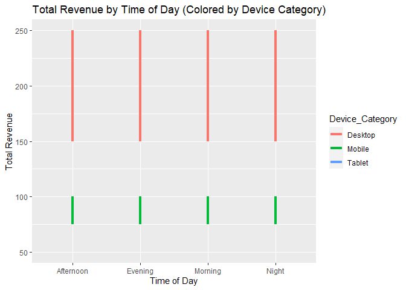
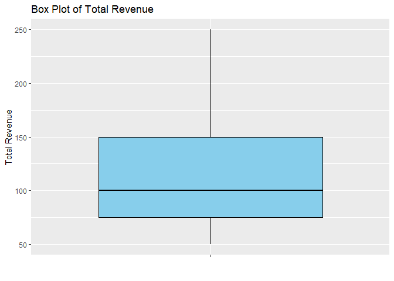
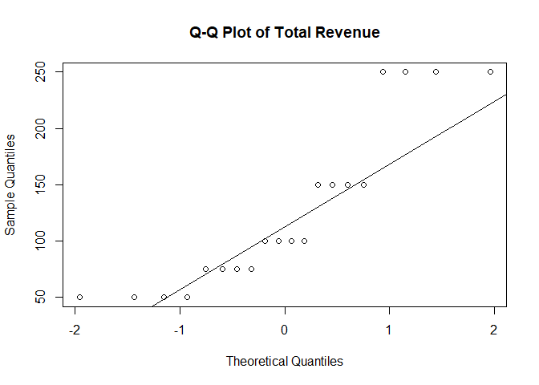
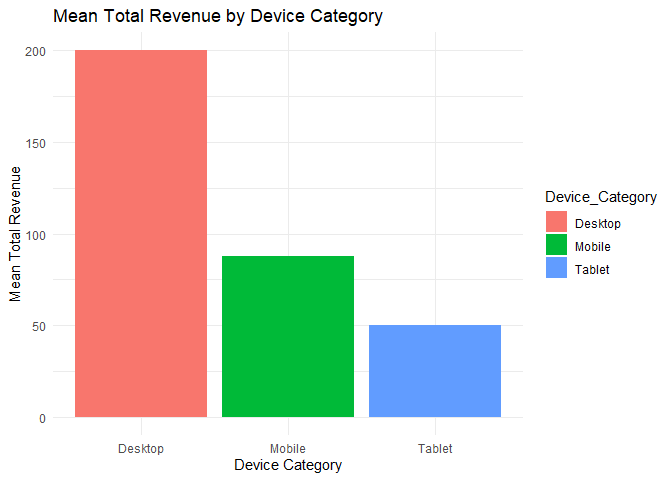
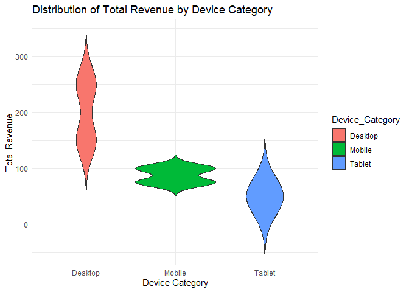
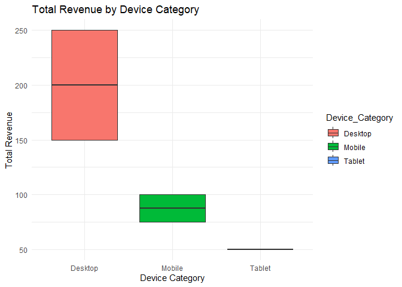

Project1
================
Satya Shiva Sai Ram Kamma
2024-02-11

## News Website Traffic and Revenue Analysing Dataset

I’m creating the dataset for the News website, which mostly depends on
website traffic and repeated visitors to earn revenue.

From this Dataset, what I’m trying to find

<b>Which time of day across different traffic sources drives the highest
number of sessions and conversions?</b>

<p>

1.  Identifying when each traffic source reaches its peak traffic allows
    us to optimize your website and its resources, such as content
    scheduling, ad campaign scheduling, and improving the responsiveness
    and loading speed of the website.

2.  Understanding how the time of day, the source of traffic, and
    website performance relate to one another allows us to make
    decisions based on data that improve user experience, maximize
    resource allocation

    </p>

<b>Is there a significant correlation between content category and
session duration?</b>

<p>

1.  We can learn what type of content is the most valuable and engaging
    to the audience by studying how long users spend on various content
    categories.

2.  This information can direct the work we do in creating content,
    ensuring that we focus on topics that interest users and hold their
    attention for a longer period of time.

3.  Identifying parts on a website where users quickly lose interest and
    quit can be improved by studying the relationship between content
    categories and session time. This enables to enhance the user
    experience, layout, or quality of the content in specific
    categories.

    </p>

<b>Are there any specific landing pages that are particularly successful
for different traffic sources or campaigns?</b>

## Find and collect data

The variables included in this dataset

    - Time of Day
    - Traffic Source
    - Landing Page
    - Campaign  
    - Device Category   
    - Avg Session Duration
    - Content Category  
    - Total Sessions    
    - Conversion Rate   
    - Total revenue

#### Dependent Variables

    - Total Sessions    
    - Conversion Rate   
    - Total revenue

#### Independent Variables

    - Time of Day
    - Traffic Source
    - Landing Page
    - Campaign  
    - Device Category   
    - Avg Session Duration
    - Content Category  

[View the CSV file](News_Website_Dataset.csv)

## Data Dictionary

<p>

<b>Total Sessions:</b> Total number of unique sessions on the website
for a specific timeframe (e.g., Day, Week, Month).

<b>Conversion Rate:</b> Percentage of visitors who complete a desired
action (e.g., Polls, Newsletter subscription).

<b>Total Revenue:</b> The total amount generated throughout the
sessions.

<b>Time of Day:</b> Categorical variable with 4 levels (Morning,
Afternoon, Evening, Night).

<b>Traffic Source:</b> Categorical variable indicating where visitors
originated from (e.g., Organic Search, Search, Referral, Direct,
Social).

<b>Landing Page:</b> The first page a visitor viewed on your website.

<b>Campaign:</b> Categorical variable indicating which marketing
campaign a visitor originated from.

<b>Device Category:</b> Categorical variable indicating the device used
to access the website (e.g., Desktop, Mobile, Tablet).

<b>Average Session Duration:</b> The average time spent by visitors on
your website per session (continuous).

<b>Content Category:</b> Categorical variable classifying the content
type of the visited page (e.g., Article, Category, About Us, Contact Us,
Home Page(/)).
<p>

``` r
library(readxl)
```

    ## Warning: package 'readxl' was built under R version 4.3.2

``` r
News_Website_Dataset <- read_excel("News Website Dataset.xlsx")
#View(News_Website_Dataset)

correlation_coefficient <- cor(News_Website_Dataset$Total_revenue, News_Website_Dataset$Avg_Session_Duration)

plot(News_Website_Dataset$Avg_Session_Duration, News_Website_Dataset$Total_revenue,
     xlab = "Average Session Duration", ylab = "Total Revenue",
     main = "Scatter Plot of Total Revenue vs. Avg Session Duration")

abline(lm(News_Website_Dataset$Total_revenue ~ News_Website_Dataset$Avg_Session_Duration), col = "red")
```

<!-- -->

``` r
print(paste("Correlation Coefficient between Total Revenue and Avg Session Duration:", correlation_coefficient))
```

    ## [1] "Correlation Coefficient between Total Revenue and Avg Session Duration: 0.536707214155583"

``` r
# correlation  and coefficient B/W Total_revenue and Total Sessions
correlation_coefficient2 <- cor(News_Website_Dataset$Total_revenue, News_Website_Dataset$Total_Sessions)
print(correlation_coefficient2)
```

    ## [1] 1

``` r
plot(News_Website_Dataset$Total_Sessions, News_Website_Dataset$Total_revenue,
     xlab = "Total Sessions", ylab = "Total Revenue",
     main = "Scatter Plot of Total Revenue vs. Total Sessions")

abline(lm(News_Website_Dataset$Total_revenue ~ News_Website_Dataset$Total_Sessions), col = "blue")
```

<!-- -->

## Assignment 2

<b>1. Univariate Analysis:</b>
<p>
<b>Question :</b> What is the distribution of total revenue?
</p>
<p>
<b>Visualization:</b> Histogram of Total Revenue
</p>

``` r
library(ggplot2)
hist(News_Website_Dataset$Total_revenue, 
     main = "Distribution of Total Revenue",
     xlab = "Total Revenue",
     ylab = "Frequency",
     col = "skyblue",
     border = "black")
```

<!-- -->
<p>
The histogram shows the distribution of total income. It means that most
of the income falls in the lower ranges, and is distributed to the
right. Small amount increases are considered excessive.
</p>
<b>2. Bivariate Analysis:</b>
<p>
<b>Question :</b> Is there a relationship between total revenue and
average session duration?
</p>
<p>
<b>Visualization:</b> Scatter plot of Total Revenue and Avg Session
Duration
</p>

``` r
library(ggplot2)
ggplot(News_Website_Dataset, aes(x = Avg_Session_Duration, y = Total_revenue)) +
  geom_point(color = "blue") +
  labs(title = "Total Revenue and Avg Session Duration",
       x = "Average Session Duration",
       y = "Total Revenue")
```

<!-- -->
<p>
The scatter plot suggests a positive correlation between total revenue
and average session duration, as higher revenue tends to coincide with
longer session durations.
</p>
<b>3. Bivariate Analysis:</b>
<p>
<b>Question :</b> How does total revenue vary across different traffic
sources?
</p>
<p>
<b>Visualization:</b> Box plot of Total Revenue by Traffic Source
</p>

``` r
library(ggplot2)
ggplot(News_Website_Dataset, aes(x = Traffic_Source, y = Total_revenue, fill = Traffic_Source)) +
  geom_boxplot() +
  labs(title = "Total Revenue by Traffic Source",
       x = "Traffic Source",
       y = "Total Revenue")
```

<!-- -->
<p>
The box plot shows variations in total revenue across different traffic
sources, with some sources having higher median revenues compared to
others.
</p>
<b>4. Multivariate Analysis:</b>
<p>
<b>Question :</b>How does total revenue vary across different device
categories and time of day?
</p>
<p>
<b>Visualization:</b> Line plot of Total Revenue by Time of Day, color
by Device Category
</p>

``` r
library(ggplot2)
ggplot(News_Website_Dataset, aes(x = Time_of_Day, y = Total_revenue, color = Device_Category)) +  geom_line(size = 1.5) +
  labs(title = "Total Revenue by Time of Day (Colored by Device Category)",
       x = "Time of Day",
       y = "Total Revenue")
```

    ## Warning: Using `size` aesthetic for lines was deprecated in ggplot2 3.4.0.
    ## ℹ Please use `linewidth` instead.
    ## This warning is displayed once every 8 hours.
    ## Call `lifecycle::last_lifecycle_warnings()` to see where this warning was
    ## generated.

<!-- -->
<p>
The line plot illustrates how total revenue varies across different
times of the day, with each line representing a different device
category. It helps identify revenue trends based on the time of day and
device usage.
</p>

## Assignment 3

##### 1. Total Revenue

<p>
Analyzing the univariate mean and variance of the “Total Revenue”
variable
</p>

``` r
library(ggplot2)
mean_revenue <- mean(News_Website_Dataset$Total_revenue)
variance_revenue <- var(News_Website_Dataset$Total_revenue)

print(paste("Mean for Total Revenue:", mean_revenue))
```

    ## [1] "Mean for Total Revenue: 125"

``` r
print(paste("Variance for Total Revenue:", variance_revenue))
```

    ## [1] "Variance for Total Revenue: 5263.15789473684"

``` r
#Box Plot for Total Revenue
ggplot(News_Website_Dataset, aes(x = "", y = Total_revenue)) +
  geom_boxplot(fill = "skyblue", color = "black") +
  labs(title = "Box Plot of Total Revenue", x = "", y = "Total Revenue")
```

<!-- -->

``` r
# Q-Q plot for Total Revenue
qqnorm(News_Website_Dataset$Total_revenue, main = "Q-Q Plot of Total Revenue")
qqline(News_Website_Dataset$Total_revenue)
```

<!-- -->
<p>
The mean total revenue provides the average amount of revenue generated
across all observations in the dataset. It gives a central measure of
the revenue distribution. The variance of total revenue indicates the
spread or dispersion of revenue values around the mean. A higher
variance suggests that revenue values are more spread out from the mean,
while a lower variance suggests that revenue values are closer to the
mean. This analysis helps us understand the typical revenue amount and
the variability in revenue generation.
</p>

#### 2. Total Revenue by Device Category

<p>
Analyzing the mean and variance of Total Revenue across different Device
Categories
</p>

``` r
library(ggplot2)
mean_revenue_device <- aggregate(Total_revenue ~ Device_Category, data = News_Website_Dataset, mean)
variance_revenue_device <- aggregate(Total_revenue ~ Device_Category, data = News_Website_Dataset, var)

print("Mean Total Revenue by Device Category")
```

    ## [1] "Mean Total Revenue by Device Category"

``` r
print(mean_revenue_device)
```

    ##   Device_Category Total_revenue
    ## 1         Desktop         200.0
    ## 2          Mobile          87.5
    ## 3          Tablet          50.0

``` r
print("Variance of Total Revenue by Device Category")
```

    ## [1] "Variance of Total Revenue by Device Category"

``` r
print(variance_revenue_device)
```

    ##   Device_Category Total_revenue
    ## 1         Desktop     2857.1429
    ## 2          Mobile      178.5714
    ## 3          Tablet        0.0000

``` r
# Bar plot for Mean Total Revenue by Device Category
ggplot(mean_revenue_device, aes(x = Device_Category, y = Total_revenue, fill = Device_Category)) +
  geom_bar(stat = "identity", position = position_dodge()) +
  labs(title = "Mean Total Revenue by Device Category", x = "Device Category", y = "Mean Total Revenue") +
  theme_minimal()
```

<!-- -->

``` r
# Violin plot for Distribution of Total Revenue by Device Category
ggplot(News_Website_Dataset, aes(x = Device_Category, y = Total_revenue, fill = Device_Category)) +
  geom_violin(trim = FALSE) +
  labs(title = "Distribution of Total Revenue by Device Category", x = "Device Category", y = "Total Revenue") +
  theme_minimal()
```

<!-- -->

``` r
# Box plot for Total Revenue by Device Category
ggplot(News_Website_Dataset, aes(x = Device_Category, y = Total_revenue, fill = Device_Category)) +
  geom_boxplot() +
  labs(title = "Total Revenue by Device Category", x = "Device Category", y = "Total Revenue") +
  theme_minimal()
```

<!-- -->
<p>
This analysis calculates the mean and variance of total revenue for each
device category separately. It helps us understand how revenue varies
across different device categories. The mean total revenue by device
category provides insight into the average revenue generated by users
using each type of device. The variance of total revenue by device
category shows the variability in revenue generation among users of the
same device category. This analysis can help identify which device
categories contribute the most to revenue and how consistent revenue
generation is across different devices
</p>
