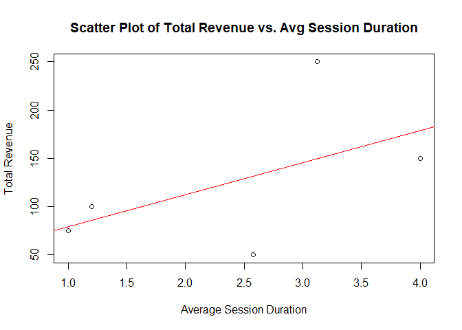
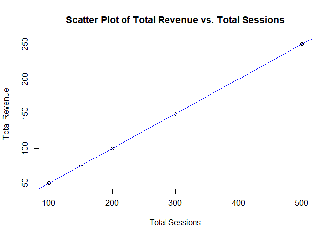

Project1
================
Satya Shiva Sai Ram Kamma
2024-02-11

## News Website Traffic and Revenue Analysing Dataset

I’m creating the dataset for the News website, which mostly depends on
website traffic and repeated visitors to earn revenue.

From this Dataset, what I’m trying to find

<b>Which time of day across different traffic sources drives the highest
number of sessions and conversions?</b>

<p>

1.  Identifying when each traffic source reaches its peak traffic allows
    us to optimize your website and its resources, such as content
    scheduling, ad campaign scheduling, and improving the responsiveness
    and loading speed of the website.

2.  Understanding how the time of day, the source of traffic, and
    website performance relate to one another allows us to make
    decisions based on data that improve user experience, maximize
    resource allocation

    </p>

<b>Is there a significant correlation between content category and
session duration?</b>

<p>

1.  We can learn what type of content is the most valuable and engaging
    to the audience by studying how long users spend on various content
    categories.

2.  This information can direct the work we do in creating content,
    ensuring that we focus on topics that interest users and hold their
    attention for a longer period of time.

3.  Identifying parts on a website where users quickly lose interest and
    quit can be improved by studying the relationship between content
    categories and session time. This enables to enhance the user
    experience, layout, or quality of the content in specific
    categories.

    </p>

<b>Are there any specific landing pages that are particularly successful
for different traffic sources or campaigns?</b>

## Find and collect data

The variables included in this dataset

    - Time of Day
    - Traffic Source
    - Landing Page
    - Campaign  
    - Device Category   
    - Avg Session Duration
    - Content Category  
    - Total Sessions    
    - Conversion Rate   
    - Total revenue

#### Dependent Variables

    - Total Sessions    
    - Conversion Rate   
    - Total revenue

#### Independent Variables

    - Time of Day
    - Traffic Source
    - Landing Page
    - Campaign  
    - Device Category   
    - Avg Session Duration
    - Content Category  

[View the CSV
file](https://github.com/sairamk-sk2915/MVA/blob/62df9652b47cd0c1cf9e9fd5d058c2e834ad2581/News_Website_Dataset.csv)

## Data Dictionary

<p>

<b>Total Sessions:</b> Total number of unique sessions on the website
for a specific timeframe (e.g., Day, Week, Month).

<b>Conversion Rate:</b> Percentage of visitors who complete a desired
action (e.g., Polls, Newslwtter subscription).

<b>Total Revenue:</b> The total amount generated throughout the
sessions.

<b>Time of Day:</b> Categorical variable with 4 levels (Morning,
Afternoon, Evening, Night).

<b>Traffic Source:</b> Categorical variable indicating where visitors
originated from (e.g., Organic Search, Search, Referral, Direct,
Social).

<b>Landing Page:</b> The first page a visitor viewed on your website.

<b>Campaign:</b> Categorical variable indicating which marketing
campaign a visitor originated from.

<b>Device Category:</b> Categorical variable indicating the device used
to access the website (e.g., Desktop, Mobile, Tablet).

<b>Average Session Duration:</b> The average time spent by visitors on
your website per session (continuous).

<b>Content Category:</b> Categorical variable classifying the content
type of the visited page (e.g., Article, Category, About Us, Contact Us,
Home Page(/)).
<p>

``` r
library(readxl)
```

    ## Warning: package 'readxl' was built under R version 4.3.2

``` r
News_Website_Dataset <- read_excel("News Website Dataset.xlsx")
#View(News_Website_Dataset)

correlation_coefficient <- cor(News_Website_Dataset$Total_revenue, News_Website_Dataset$Avg_Session_Duration)

plot(News_Website_Dataset$Avg_Session_Duration, News_Website_Dataset$Total_revenue,
     xlab = "Average Session Duration", ylab = "Total Revenue",
     main = "Scatter Plot of Total Revenue vs. Avg Session Duration")

abline(lm(News_Website_Dataset$Total_revenue ~ News_Website_Dataset$Avg_Session_Duration), col = "red")
```

<!-- -->

``` r
print(paste("Correlation Coefficient between Total Revenue and Avg Session Duration:", correlation_coefficient))
```

    ## [1] "Correlation Coefficient between Total Revenue and Avg Session Duration: 0.536707214155583"

``` r
# correlation  and coefficient B/W Total_revenue and Total Sessions
correlation_coefficient2 <- cor(News_Website_Dataset$Total_revenue, News_Website_Dataset$Total_Sessions)
print(correlation_coefficient2)
```

    ## [1] 1

``` r
plot(News_Website_Dataset$Total_Sessions, News_Website_Dataset$Total_revenue,
     xlab = "Total Sessions", ylab = "Total Revenue",
     main = "Scatter Plot of Total Revenue vs. Total Sessions")

abline(lm(News_Website_Dataset$Total_revenue ~ News_Website_Dataset$Total_Sessions), col = "blue")
```

<!-- -->
