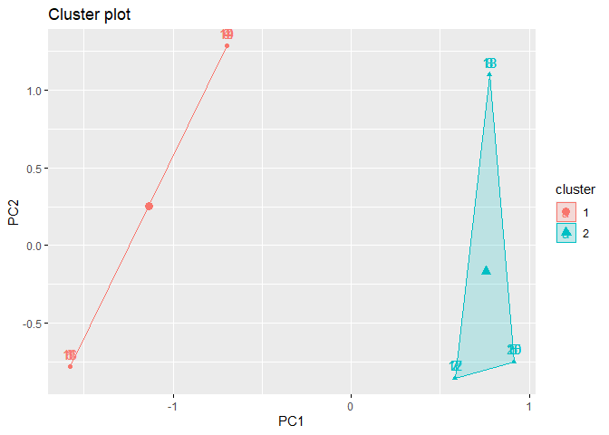
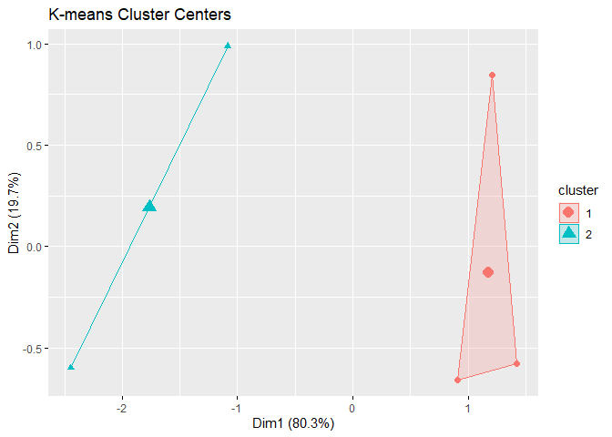
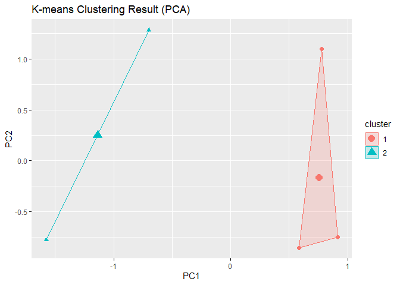
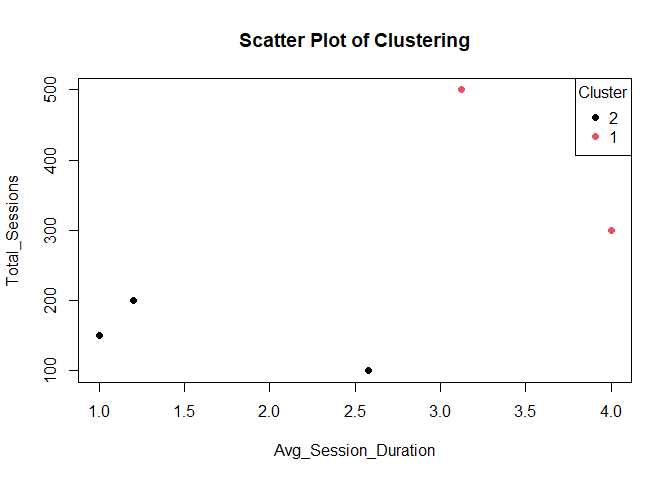
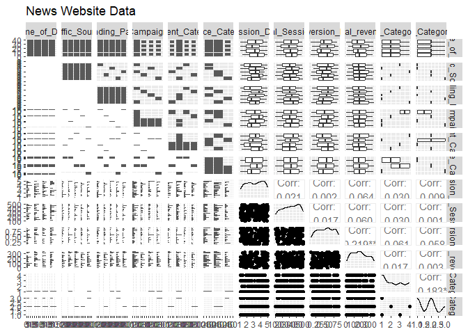
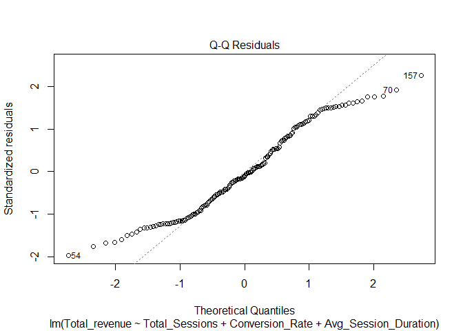
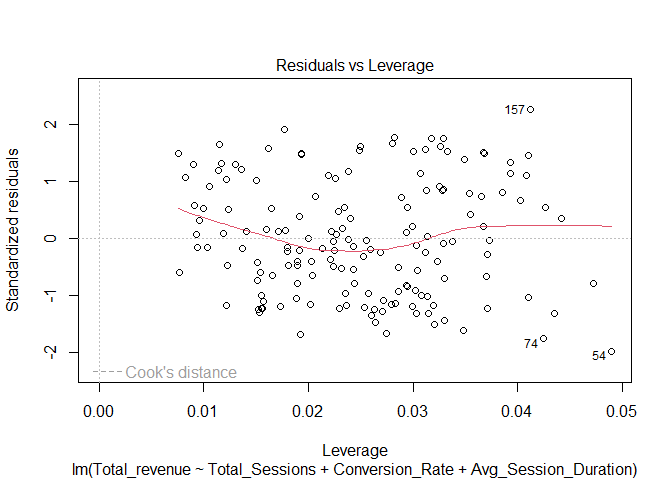
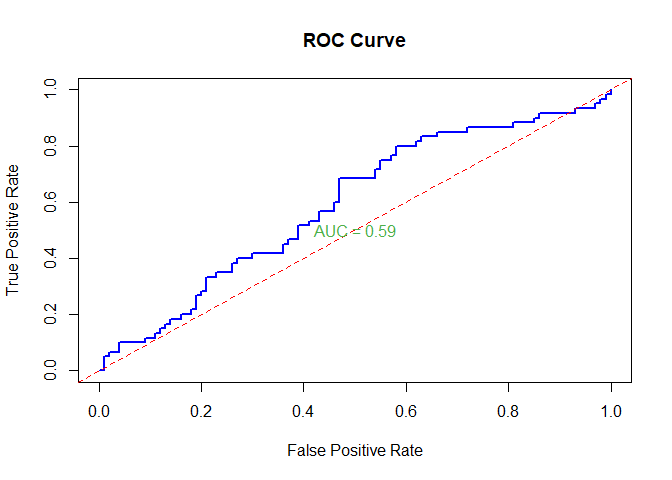

News Website Traffic and Revenue Analysing Dataset
================
Satya Shiva Sai Ram Kamma
2024-02-11

I’m creating the dataset for the News website, which mostly depends on
website traffic and repeated visitors to earn revenue.

From this Dataset, what I’m trying to find

<b>Which time of day across different traffic sources drives the highest
number of sessions and conversions?</b>

<p>

1.  Identifying when each traffic source reaches its peak traffic allows
    us to optimize your website and its resources, such as content
    scheduling, ad campaign scheduling, and improving the responsiveness
    and loading speed of the website.

2.  Understanding how the time of day, the source of traffic, and
    website performance relate to one another allows us to make
    decisions based on data that improve user experience, maximize
    resource allocation

    </p>

<b>Is there a significant correlation between content category and
session duration?</b>

<p>

1.  We can learn what type of content is the most valuable and engaging
    to the audience by studying how long users spend on various content
    categories.

2.  This information can direct the work we do in creating content,
    ensuring that we focus on topics that interest users and hold their
    attention for a longer period of time.

3.  Identifying parts on a website where users quickly lose interest and
    quit can be improved by studying the relationship between content
    categories and session time. This enables to enhance the user
    experience, layout, or quality of the content in specific
    categories.

    </p>

<b>Are there any specific landing pages that are particularly successful
for different traffic sources or campaigns?</b>

## Find and collect data

The variables included in this dataset

    - Time of Day
    - Traffic Source
    - Landing Page
    - Campaign  
    - Device Category   
    - Avg Session Duration
    - Content Category  
    - Total Sessions    
    - Conversion Rate   
    - Total revenue

#### Dependent Variables

    - Total Sessions    
    - Conversion Rate   
    - Total revenue

#### Independent Variables

    - Time of Day
    - Traffic Source
    - Landing Page
    - Campaign  
    - Device Category   
    - Avg Session Duration
    - Content Category  

[View the CSV file](News_Website_Dataset.csv)

## Data Dictionary

<p>

<b>Total Sessions:</b> Total number of unique sessions on the website
for a specific timeframe (e.g., Day, Week, Month).

<b>Conversion Rate:</b> Percentage of visitors who complete a desired
action (e.g., Polls, Newsletter subscription).

<b>Total Revenue:</b> The total amount generated throughout the
sessions.

<b>Time of Day:</b> Categorical variable with 4 levels (Morning,
Afternoon, Evening, Night).

<b>Traffic Source:</b> Categorical variable indicating where visitors
originated from (e.g., Organic Search, Search, Referral, Direct,
Social).

<b>Landing Page:</b> The first page a visitor viewed on your website.

<b>Campaign:</b> Categorical variable indicating which marketing
campaign a visitor originated from.

<b>Device Category:</b> Categorical variable indicating the device used
to access the website (e.g., Desktop, Mobile, Tablet).

<b>Average Session Duration:</b> The average time spent by visitors on
your website per session (continuous).

<b>Content Category:</b> Categorical variable classifying the content
type of the visited page (e.g., Article, Category, About Us, Contact Us,
Home Page(/)).
<p>

``` r
library(readxl)
```

    ## Warning: package 'readxl' was built under R version 4.3.2

``` r
News_Website_Dataset <- read_excel("News Website Dataset.xlsx")
#View(News_Website_Dataset)

correlation_coefficient <- cor(News_Website_Dataset$Total_revenue, News_Website_Dataset$Avg_Session_Duration)


plot(News_Website_Dataset$Avg_Session_Duration, News_Website_Dataset$Total_revenue,
     xlab = "Average Session Duration", ylab = "Total Revenue",
     main = "Scatter Plot of Total Revenue vs. Avg Session Duration")

abline(lm(News_Website_Dataset$Total_revenue ~ News_Website_Dataset$Avg_Session_Duration), col = "red")
```

<!-- -->

``` r
print(paste("Correlation Coefficient between Total Revenue and Avg Session Duration:", correlation_coefficient))
```

    ## [1] "Correlation Coefficient between Total Revenue and Avg Session Duration: 0.536707214155583"

``` r
# correlation  and coefficient B/W Total_revenue and Total Sessions
correlation_coefficient2 <- cor(News_Website_Dataset$Total_revenue, News_Website_Dataset$Total_Sessions)
print(correlation_coefficient2)
```

    ## [1] 1

``` r
plot(News_Website_Dataset$Total_Sessions, News_Website_Dataset$Total_revenue,
     xlab = "Total Sessions", ylab = "Total Revenue",
     main = "Scatter Plot of Total Revenue vs. Total Sessions")

abline(lm(News_Website_Dataset$Total_revenue ~ News_Website_Dataset$Total_Sessions), col = "blue")
```

<!-- -->

## Assignment 2

<b>1. Univariate Analysis:</b>
<p>
<b>Question :</b> What is the distribution of total revenue?
</p>
<p>
<b>Visualization:</b> Histogram of Total Revenue
</p>

``` r
library(ggplot2)
hist(News_Website_Dataset$Total_revenue, 
     main = "Distribution of Total Revenue",
     xlab = "Total Revenue",
     ylab = "Frequency",
     col = "skyblue",
     border = "black")
```

<!-- -->
<p>
The histogram shows the distribution of total income. It means that most
of the income falls in the lower ranges, and is distributed to the
right. Small amount increases are considered excessive.
</p>
<b>2. Bivariate Analysis:</b>
<p>
<b>Question :</b> Is there a relationship between total revenue and
average session duration?
</p>
<p>
<b>Visualization:</b> Scatter plot of Total Revenue and Avg Session
Duration
</p>

``` r
library(ggplot2)
ggplot(News_Website_Dataset, aes(x = Avg_Session_Duration, y = Total_revenue)) +
  geom_point(color = "blue") +
  labs(title = "Total Revenue and Avg Session Duration",
       x = "Average Session Duration",
       y = "Total Revenue")
```

<!-- -->
<p>
The scatter plot suggests a positive correlation between total revenue
and average session duration, as higher revenue tends to coincide with
longer session durations.
</p>
<b>3. Bivariate Analysis:</b>
<p>
<b>Question :</b> How does total revenue vary across different traffic
sources?
</p>
<p>
<b>Visualization:</b> Box plot of Total Revenue by Traffic Source
</p>

``` r
library(ggplot2)
ggplot(News_Website_Dataset, aes(x = Traffic_Source, y = Total_revenue, fill = Traffic_Source)) +
  geom_boxplot() +
  labs(title = "Total Revenue by Traffic Source",
       x = "Traffic Source",
       y = "Total Revenue")
```

<!-- -->
<p>
The box plot shows variations in total revenue across different traffic
sources, with some sources having higher median revenues compared to
others.
</p>
<b>4. Multivariate Analysis:</b>
<p>
<b>Question :</b>How does total revenue vary across different device
categories and time of day?
</p>
<p>
<b>Visualization:</b> Line plot of Total Revenue by Time of Day, color
by Device Category
</p>

``` r
library(ggplot2)
ggplot(News_Website_Dataset, aes(x = Time_of_Day, y = Total_revenue, color = Device_Category)) +  geom_line(size = 1.5) +
  labs(title = "Total Revenue by Time of Day (Colored by Device Category)",
       x = "Time of Day",
       y = "Total Revenue")
```

    ## Warning: Using `size` aesthetic for lines was deprecated in ggplot2 3.4.0.
    ## ℹ Please use `linewidth` instead.
    ## This warning is displayed once every 8 hours.
    ## Call `lifecycle::last_lifecycle_warnings()` to see where this warning was
    ## generated.

<!-- -->
<p>
The line plot illustrates how total revenue varies across different
times of the day, with each line representing a different device
category. It helps identify revenue trends based on the time of day and
device usage.
</p>

## Assignment 3

##### 1. Total Revenue

<p>
Analyzing the univariate mean and variance of the “Total Revenue”
variable
</p>

``` r
library(ggplot2)
mean_revenue <- mean(News_Website_Dataset$Total_revenue)
variance_revenue <- var(News_Website_Dataset$Total_revenue)

print(paste("Mean for Total Revenue:", mean_revenue))
```

    ## [1] "Mean for Total Revenue: 125"

``` r
print(paste("Variance for Total Revenue:", variance_revenue))
```

    ## [1] "Variance for Total Revenue: 5263.15789473684"

``` r
#Box Plot for Total Revenue
ggplot(News_Website_Dataset, aes(x = "", y = Total_revenue)) +
  geom_boxplot(fill = "skyblue", color = "black") +
  labs(title = "Box Plot of Total Revenue", x = "", y = "Total Revenue")
```

<!-- -->

``` r
# Q-Q plot for Total Revenue
qqnorm(News_Website_Dataset$Total_revenue, main = "Q-Q Plot of Total Revenue")
qqline(News_Website_Dataset$Total_revenue)
```

<!-- -->
<p>
The mean total revenue provides the average amount of revenue generated
across all observations in the dataset. It gives a central measure of
the revenue distribution. The variance of total revenue indicates the
spread or dispersion of revenue values around the mean. A higher
variance suggests that revenue values are more spread out from the mean,
while a lower variance suggests that revenue values are closer to the
mean. This analysis helps us understand the typical revenue amount and
the variability in revenue generation.
</p>

#### 2. Total Revenue by Device Category

<p>
Analyzing the mean and variance of Total Revenue across different Device
Categories
</p>

``` r
library(ggplot2)
mean_revenue_device <- aggregate(Total_revenue ~ Device_Category, data = News_Website_Dataset, mean)
variance_revenue_device <- aggregate(Total_revenue ~ Device_Category, data = News_Website_Dataset, var)

print("Mean Total Revenue by Device Category")
```

    ## [1] "Mean Total Revenue by Device Category"

``` r
print(mean_revenue_device)
```

    ##   Device_Category Total_revenue
    ## 1         Desktop         200.0
    ## 2          Mobile          87.5
    ## 3          Tablet          50.0

``` r
print("Variance of Total Revenue by Device Category")
```

    ## [1] "Variance of Total Revenue by Device Category"

``` r
print(variance_revenue_device)
```

    ##   Device_Category Total_revenue
    ## 1         Desktop     2857.1429
    ## 2          Mobile      178.5714
    ## 3          Tablet        0.0000

``` r
# Bar plot for Mean Total Revenue by Device Category
ggplot(mean_revenue_device, aes(x = Device_Category, y = Total_revenue, fill = Device_Category)) +
  geom_bar(stat = "identity", position = position_dodge()) +
  labs(title = "Mean Total Revenue by Device Category", x = "Device Category", y = "Mean Total Revenue") +
  theme_minimal()
```

<!-- -->

``` r
# Violin plot for Distribution of Total Revenue by Device Category
ggplot(News_Website_Dataset, aes(x = Device_Category, y = Total_revenue, fill = Device_Category)) +
  geom_violin(trim = FALSE) +
  labs(title = "Distribution of Total Revenue by Device Category", x = "Device Category", y = "Total Revenue") +
  theme_minimal()
```

<!-- -->

``` r
# Box plot for Total Revenue by Device Category
ggplot(News_Website_Dataset, aes(x = Device_Category, y = Total_revenue, fill = Device_Category)) +
  geom_boxplot() +
  labs(title = "Total Revenue by Device Category", x = "Device Category", y = "Total Revenue") +
  theme_minimal()
```

<!-- -->
<p>
This analysis calculates the mean and variance of total revenue for each
device category separately. It helps us understand how revenue varies
across different device categories. The mean total revenue by device
category provides insight into the average revenue generated by users
using each type of device. The variance of total revenue by device
category shows the variability in revenue generation among users of the
same device category. This analysis can help identify which device
categories contribute the most to revenue and how consistent revenue
generation is across different devices
</p>

### Assignment 4

<p>
1 Decide how many Principal Components (PCs) you want to keep and why
</p>
<p>
2 Explain the variate representation each PCs
</p>
<p>
3 Perform some visualization using PCs.
</p>

``` r
News_Website_Dataset_num <- read_excel("News Website Dataset.xlsx", range = cell_cols("F:J"))
cor(News_Website_Dataset_num[-1])
```

    ##                      Avg_Session_Duration Total_Sessions Conversion_Rate
    ## Avg_Session_Duration            1.0000000      0.5367072      -0.3166230
    ## Total_Sessions                  0.5367072      1.0000000      -0.1767767
    ## Conversion_Rate                -0.3166230     -0.1767767       1.0000000
    ## Total_revenue                   0.5367072      1.0000000      -0.1767767
    ##                      Total_revenue
    ## Avg_Session_Duration     0.5367072
    ## Total_Sessions           1.0000000
    ## Conversion_Rate         -0.1767767
    ## Total_revenue            1.0000000

``` r
News_Website_Dataset_num_pca <- prcomp(News_Website_Dataset_num[,-1],scale=TRUE)
News_Website_Dataset_num_pca
```

    ## Standard deviations (1, .., p=4):
    ## [1] 1.5814745 0.9858789 0.7259348 0.0000000
    ## 
    ## Rotation (n x k) = (4 x 4):
    ##                             PC1        PC2        PC3           PC4
    ## Avg_Session_Duration -0.4779751 -0.2224537 -0.8497377  0.000000e+00
    ## Total_Sessions       -0.5971722  0.2703526  0.2651318 -7.071068e-01
    ## Conversion_Rate       0.2414759  0.8968463 -0.3706158  4.996004e-16
    ## Total_revenue        -0.5971722  0.2703526  0.2651318  7.071068e-01

``` r
summary(News_Website_Dataset_num_pca)
```

    ## Importance of components:
    ##                           PC1    PC2    PC3 PC4
    ## Standard deviation     1.5815 0.9859 0.7259   0
    ## Proportion of Variance 0.6253 0.2430 0.1318   0
    ## Cumulative Proportion  0.6253 0.8682 1.0000   1

``` r
(eigen_News_Website_Dataset <- News_Website_Dataset_num_pca$sdev^2)
```

    ## [1] 2.5010615 0.9719572 0.5269813 0.0000000

``` r
names(eigen_News_Website_Dataset) <- paste("PC",1:4,sep="")
eigen_News_Website_Dataset
```

    ##       PC1       PC2       PC3       PC4 
    ## 2.5010615 0.9719572 0.5269813 0.0000000

``` r
sumlambdas <- sum(eigen_News_Website_Dataset)
sumlambdas
```

    ## [1] 4

``` r
propvar <- eigen_News_Website_Dataset/sumlambdas
propvar
```

    ##       PC1       PC2       PC3       PC4 
    ## 0.6252654 0.2429893 0.1317453 0.0000000

``` r
cumvar_News_Website_Dataset <- cumsum(propvar)
cumvar_News_Website_Dataset
```

    ##       PC1       PC2       PC3       PC4 
    ## 0.6252654 0.8682547 1.0000000 1.0000000

``` r
matlambdas <- rbind(eigen_News_Website_Dataset,propvar,cumvar_News_Website_Dataset)
rownames(matlambdas) <- c("Eigenvalues","Prop. variance","Cum. prop. variance")
round(matlambdas,4)
```

    ##                        PC1    PC2    PC3 PC4
    ## Eigenvalues         2.5011 0.9720 0.5270   0
    ## Prop. variance      0.6253 0.2430 0.1317   0
    ## Cum. prop. variance 0.6253 0.8683 1.0000   1

``` r
summary(News_Website_Dataset_num_pca)
```

    ## Importance of components:
    ##                           PC1    PC2    PC3 PC4
    ## Standard deviation     1.5815 0.9859 0.7259   0
    ## Proportion of Variance 0.6253 0.2430 0.1318   0
    ## Cumulative Proportion  0.6253 0.8682 1.0000   1

``` r
News_Website_Dataset_num_pca$rotation
```

    ##                             PC1        PC2        PC3           PC4
    ## Avg_Session_Duration -0.4779751 -0.2224537 -0.8497377  0.000000e+00
    ## Total_Sessions       -0.5971722  0.2703526  0.2651318 -7.071068e-01
    ## Conversion_Rate       0.2414759  0.8968463 -0.3706158  4.996004e-16
    ## Total_revenue        -0.5971722  0.2703526  0.2651318  7.071068e-01

``` r
print(News_Website_Dataset_num_pca)
```

    ## Standard deviations (1, .., p=4):
    ## [1] 1.5814745 0.9858789 0.7259348 0.0000000
    ## 
    ## Rotation (n x k) = (4 x 4):
    ##                             PC1        PC2        PC3           PC4
    ## Avg_Session_Duration -0.4779751 -0.2224537 -0.8497377  0.000000e+00
    ## Total_Sessions       -0.5971722  0.2703526  0.2651318 -7.071068e-01
    ## Conversion_Rate       0.2414759  0.8968463 -0.3706158  4.996004e-16
    ## Total_revenue        -0.5971722  0.2703526  0.2651318  7.071068e-01

``` r
News_Website_Dataset_num_pca$x
```

    ##             PC1        PC2         PC3           PC4
    ##  [1,] -2.404150  0.6271108  0.44420691  6.661338e-16
    ##  [2,]  1.290564  1.5130222  0.06426287  7.216450e-16
    ##  [3,]  1.256024 -0.2145550 -0.85140879 -1.110223e-16
    ##  [4,] -1.264284 -0.8317676 -0.69973980 -2.775558e-16
    ##  [5,]  1.121846 -1.0938104  1.04267882 -7.771561e-16
    ##  [6,] -2.404150  0.6271108  0.44420691  6.661338e-16
    ##  [7,]  1.290564  1.5130222  0.06426287  7.216450e-16
    ##  [8,]  1.256024 -0.2145550 -0.85140879 -1.110223e-16
    ##  [9,] -1.264284 -0.8317676 -0.69973980 -2.775558e-16
    ## [10,]  1.121846 -1.0938104  1.04267882 -7.771561e-16
    ## [11,] -2.404150  0.6271108  0.44420691  6.661338e-16
    ## [12,]  1.290564  1.5130222  0.06426287  7.216450e-16
    ## [13,]  1.256024 -0.2145550 -0.85140879 -1.110223e-16
    ## [14,] -1.264284 -0.8317676 -0.69973980 -2.775558e-16
    ## [15,]  1.121846 -1.0938104  1.04267882 -7.771561e-16
    ## [16,] -2.404150  0.6271108  0.44420691  6.661338e-16
    ## [17,]  1.290564  1.5130222  0.06426287  7.216450e-16
    ## [18,]  1.256024 -0.2145550 -0.85140879 -1.110223e-16
    ## [19,] -1.264284 -0.8317676 -0.69973980 -2.775558e-16
    ## [20,]  1.121846 -1.0938104  1.04267882 -7.771561e-16

``` r
library(FactoMineR)
```

    ## Warning: package 'FactoMineR' was built under R version 4.3.3

``` r
encoded_data <- model.matrix(~Device_Category - 1, data = News_Website_Dataset_num)
numerical_data <- cbind(News_Website_Dataset_num[, -which(names(News_Website_Dataset_num) == "Device_Category")], encoded_data)

#PCA
pca_result <- prcomp(numerical_data, scale = TRUE)

# Scree plot
plot(pca_result$sdev^2, type = "b", xlab = "Principal Component", ylab = "Variance Explained")
```

<!-- -->

``` r
loadings <- pca_result$rotation
print(loadings)
```

    ##                               PC1          PC2         PC3        PC4
    ## Avg_Session_Duration   -0.4106821 -0.374429007 -0.02446949 -0.5400865
    ## Total_Sessions         -0.4471330  0.237378541  0.23649813  0.3887130
    ## Conversion_Rate         0.1978333  0.002972559  0.93005313 -0.2969749
    ## Total_revenue          -0.4471330  0.237378541  0.23649813  0.3887130
    ## Device_CategoryDesktop -0.4908267  0.017567881 -0.03728123 -0.2812453
    ## Device_CategoryMobile   0.3469895  0.535940060 -0.06777750 -0.1079177
    ## Device_CategoryTablet   0.1761639 -0.677906012  0.12867014  0.4766254
    ##                                  PC5         PC6          PC7
    ## Avg_Session_Duration   -0.5083067855 -0.37122684  0.051631846
    ## Total_Sessions         -0.1142508742 -0.26319860 -0.674067900
    ## Conversion_Rate         0.0704434778  0.05144631 -0.007155377
    ## Total_revenue          -0.1941033119  0.03800123  0.705389331
    ## Device_CategoryDesktop  0.8050246026 -0.15421830  0.080273384
    ## Device_CategoryMobile   0.0008156666 -0.74154853  0.161961832
    ## Device_CategoryTablet   0.1945952061 -0.46384136  0.112542699

``` r
# Data projection onto first two PCs
data_projection <- as.data.frame(pca_result$x[, 1:2])

# Data projection onto next two PCs
data_projection2 <- as.data.frame(pca_result$x[, 3:4])

# Plot
plot(data_projection$PC1, data_projection$PC2, 
     xlab = "PC1", ylab = "PC2", 
     main = "Data Visualization using PCs - 1")
```

<!-- -->

``` r
# Plot
plot(data_projection2$PC3, data_projection2$PC4, col = "red",
     xlab = "PC3", ylab = "PC4", 
     main = "Data Visualization using PCs - 2")
```

<!-- -->

### Assignment 5

<p>
For each model, decide the optimal number of clusters and explain why
</p>
<p>
Show the membership for each cluster
</p>
<p>
show a visualization of the cluster and membership using the first two
Principal Components
</p>

``` r
# Load necessary libraries
library(cluster)
library(factoextra)
```

    ## Warning: package 'factoextra' was built under R version 4.3.2

    ## Welcome! Want to learn more? See two factoextra-related books at https://goo.gl/ve3WBa

``` r
library(magrittr)
library(NbClust)

data <- read_excel("News Website Dataset.xlsx")

data_num <- data[, c("Avg_Session_Duration", "Total_Sessions", "Total_revenue")]
dist_matrix <- dist(data_num)

# Hierarchical clustering
hclust_model <- hclust(dist_matrix)

plot(hclust_model)
```

<!-- -->

``` r
num_clusters <- 3
clusters <- cutree(hclust_model, k = num_clusters)

# Membership for each cluster
table(clusters)
```

    ## clusters
    ##  1  2  3 
    ##  4 12  4

``` r
# Visualize cluster and membership using first two Principal Components
pca_result <- prcomp(data_num, scale = TRUE)
fviz_cluster(list(data = pca_result$x[, 1:2], cluster = clusters))
```

<!-- -->

``` r
# Non-hierarchical clustering (k-means)
num_clusters <- 2  
kmeans_model <- kmeans(data_num, centers = num_clusters)

# Membership for each cluster
table(kmeans_model$cluster)
```

    ## 
    ##  1  2 
    ##  8 12

``` r
# Visualize cluster and membership using first two Principal Components
fviz_cluster(list(data = pca_result$x[, 1:2], cluster = kmeans_model$cluster))
```

<!-- -->

``` r
# Load necessary libraries
library(cluster)
library(factoextra)
library(magrittr)
library(NbClust)
library(readxl)

# Read the dataset
data <- read_excel("News Website Dataset.xlsx")

# Select numerical variables for clustering
data_num <- data[, c("Avg_Session_Duration", "Total_Sessions", "Total_revenue")]

# Perform hierarchical clustering
dist_matrix <- dist(data_num)
hclust_model <- hclust(dist_matrix)

# Decide on the optimal number of clusters based on the dendrogram
num_clusters_hclust <- 3  # Replace with chosen number of clusters

# Perform non-hierarchical clustering (k-means)
num_clusters_kmeans <- 2  # Replace with the chosen number of clusters
kmeans_model <- kmeans(data_num, centers = num_clusters_kmeans)

# Visualize cluster centers for k-means
fviz_cluster(kmeans_model, data = data_num, geom = "point", frame.type = "convex", 
             pointsize = 2, fill = "white", main = "K-means Cluster Centers")
```

    ## Warning: argument frame is deprecated; please use ellipse instead.

    ## Warning: argument frame.type is deprecated; please use ellipse.type instead.

<!-- -->

``` r
# Visualize cluster and membership using first two Principal Components for k-means
pca_result <- prcomp(data_num, scale = TRUE)
fviz_cluster(kmeans_model, data = pca_result$x[, 1:2], geom = "point", 
             pointsize = 2, fill = "white", main = "K-means Clustering Result (PCA)")
```

<!-- -->

``` r
# Calculate silhouette information for k-means clustering
sil <- silhouette(kmeans_model$cluster, dist(data_num))

# Visualize the silhouette plot for k-means clustering
fviz_silhouette(sil, main = "Silhouette Plot for K-means Clustering")
```

    ##   cluster size ave.sil.width
    ## 1       1   12          0.80
    ## 2       2    8          0.46

<!-- -->

``` r
# Create a data frame with cluster membership
data_clustered <- cbind(data_num, Cluster = kmeans_model$cluster)

# Scatter plot of data points colored by cluster membership
plot(data_clustered$Avg_Session_Duration, data_clustered$Total_Sessions, 
     col = data_clustered$Cluster, pch = 16, 
     xlab = "Avg_Session_Duration", ylab = "Total_Sessions",
     main = "Scatter Plot of Clustering")
legend("topright", legend = unique(data_clustered$Cluster), 
       col = 1:num_clusters_kmeans, pch = 16, title = "Cluster")
```

<!-- -->

### Assignment 6

<h4>
Factor Analysis
</h4>
<p>
<b>1. Decide how many Factors are ideal for your dataset</b>
</p>
<p>
Parallel analysis suggests that the number of factors = 1 and the number
of components = 1
</p>
<p>
<b>2. Explain the output for your factor model</b>
</p>
<p>
<b>Standardized Loadings</b>
</p>
<p>
Avg_Session_Duration has low loadings on all factors, with the highest
loading on MR3 (0.32).
</p>
<p>
Total_Sessions has the highest loading on MR2 (0.34).
</p>
<p>
Total_revenue and Conversion_Rate both have the highest loadings on MR1
(0.48 and 0.50, respectively).
</p>
<p>
<b>SS Loadings</b>
</p>
<p>
MR1 explains 12% of the total variance., MR2 explains 4% of the total
variance., MR3 explains 3% of the total variance.
</p>
<p>
MR1 might be related to conversion rate and potentially session duration
(positive loadings).
</p>
<p>
MR2 is positively associated with the total number of sessions.
</p>
<p>
MR3 has weaker and mixed relationships with the variables.
</p>
<p>
we can conclude that a 3-factor solution adequately explains the
structure of the data. Each factor captures a unique aspect of the
underlying structure, with Total_revenue and Conversion_Rate loading
primarily on MR1, Total_Sessions on MR2, and Avg_Session_Duration on
MR3.
</p>
<p>
<b> 3&4 Show the columns that go into each factor and Perform some
visualizations using the factors</b>
</p>
<p>

we can see the below code to answer 3&4.

``` r
library(psych)
```

    ## Warning: package 'psych' was built under R version 4.3.3

    ## 
    ## Attaching package: 'psych'

    ## The following objects are masked from 'package:ggplot2':
    ## 
    ##     %+%, alpha

``` r
library(readxl)
data <- read_excel("News Website Dataset_2.xlsx")
data_num <- data[, c("Avg_Session_Duration", "Total_Sessions", "Total_revenue","Conversion_Rate")]
factor_model <- fa(data_num, nfactors = 3, rotate = "varimax")

fa.parallel(data_num[-1])
```

    ## Warning in fa.stats(r = r, f = f, phi = phi, n.obs = n.obs, np.obs = np.obs, :
    ## The estimated weights for the factor scores are probably incorrect.  Try a
    ## different factor score estimation method.

    ## Warning in fac(r = r, nfactors = nfactors, n.obs = n.obs, rotate = rotate, : An
    ## ultra-Heywood case was detected.  Examine the results carefully

<!-- -->

    ## Parallel analysis suggests that the number of factors =  1  and the number of components =  0

``` r
print(factor_model)
```

    ## Factor Analysis using method =  minres
    ## Call: fa(r = data_num, nfactors = 3, rotate = "varimax")
    ## Standardized loadings (pattern matrix) based upon correlation matrix
    ##                        MR1   MR2   MR3   h2   u2 com
    ## Avg_Session_Duration -0.02  0.03  0.32 0.10 0.90 1.0
    ## Total_Sessions        0.01  0.34  0.03 0.12 0.88 1.0
    ## Total_revenue         0.48  0.18 -0.18 0.30 0.70 1.6
    ## Conversion_Rate       0.50 -0.07  0.05 0.25 0.75 1.1
    ## 
    ##                        MR1  MR2  MR3
    ## SS loadings           0.48 0.15 0.14
    ## Proportion Var        0.12 0.04 0.03
    ## Cumulative Var        0.12 0.16 0.19
    ## Proportion Explained  0.62 0.20 0.18
    ## Cumulative Proportion 0.62 0.82 1.00
    ## 
    ## Mean item complexity =  1.2
    ## Test of the hypothesis that 3 factors are sufficient.
    ## 
    ## df null model =  6  with the objective function =  0.06 with Chi Square =  9.18
    ## df of  the model are -3  and the objective function was  0 
    ## 
    ## The root mean square of the residuals (RMSR) is  0 
    ## The df corrected root mean square of the residuals is  NA 
    ## 
    ## The harmonic n.obs is  160 with the empirical chi square  0  with prob <  NA 
    ## The total n.obs was  160  with Likelihood Chi Square =  0  with prob <  NA 
    ## 
    ## Tucker Lewis Index of factoring reliability =  2.959
    ## Fit based upon off diagonal values = 1
    ## Measures of factor score adequacy             
    ##                                                     MR1   MR2   MR3
    ## Correlation of (regression) scores with factors    0.63  0.39  0.37
    ## Multiple R square of scores with factors           0.39  0.15  0.14
    ## Minimum correlation of possible factor scores     -0.21 -0.69 -0.72

``` r
factor_loadings <- factor_model$loadings
print(factor_loadings)
```

    ## 
    ## Loadings:
    ##                      MR1    MR2    MR3   
    ## Avg_Session_Duration                0.320
    ## Total_Sessions               0.342       
    ## Total_revenue         0.483  0.176 -0.184
    ## Conversion_Rate       0.496              
    ## 
    ##                 MR1   MR2   MR3
    ## SS loadings    0.48 0.154 0.140
    ## Proportion Var 0.12 0.039 0.035
    ## Cumulative Var 0.12 0.159 0.193

``` r
#some visualizations
fa.plot(factor_model)      # See Correlations within Factors
```

<!-- -->

``` r
fa.diagram(factor_model)   # Visualize the relationship
```

<!-- -->

### Assignment 7

### Multiple Regression Analysis

<p>
Multiple regression analysis is a statistical technique that extends
simple linear regression by considering the combined effect of two or
more independent variables on a single dependent variable. It helps us
understand how these independent variables influence the dependent
variable, predict the value of the dependent variable based on the
independent ones, and assess the relative importance of each independent
variable while accounting for the influence of others. This makes it a
powerful tool for various fields like business, finance, and social
science to uncover relationships and make predictions.
</p>

#### Model Development

<p>
We will load the data and convert the data into numerical. we will split
the data into training and testing data. then we will perform multiple
regression model
</p>

#### Model Acceptance

<p>
Model acceptance involves evaluating the performance of the multiple
regression model on unseen data or a testing dataset
</p>
<p>
It evaluates the model’s performance through coefficient summaries,
diagnostic plots, and confidence intervals. Overall, it aims to assess
the model’s acceptance by analyzing its fit to the data and the
significance of predictor variables.
</p>

#### Residual Analysis

<p>
Residual analysis is crucial for evaluating the assumptions of the
multiple regression model and identifying any patterns or trends in the
residuals
</p>
<p>
It will generate diagnostic plots, including a plot of residuals
vs. fitted values, a QQ plot of residuals, and a scale-location plot.
These plots can help you assess the assumptions of the multiple
regression model.
</p>

``` r
library(readxl)
library(dplyr)
```

    ## 
    ## Attaching package: 'dplyr'

    ## The following objects are masked from 'package:stats':
    ## 
    ##     filter, lag

    ## The following objects are masked from 'package:base':
    ## 
    ##     intersect, setdiff, setequal, union

``` r
mydata <- read_excel("News Website Dataset_2.xlsx")
data_num <- mydata[, c("Avg_Session_Duration", "Total_Sessions", "Total_revenue","Conversion_Rate")]
```

#### Model Development

``` r
model <- lm(Total_revenue ~ Total_Sessions
+ Conversion_Rate + Avg_Session_Duration, data = mydata)
model_fit <- summary(model)
print(model_fit)
```

    ## 
    ## Call:
    ## lm(formula = Total_revenue ~ Total_Sessions + Conversion_Rate + 
    ##     Avg_Session_Duration, data = mydata)
    ## 
    ## Residuals:
    ##     Min      1Q  Median      3Q     Max 
    ## -184.85  -81.61  -10.46   78.97  212.17 
    ## 
    ## Coefficients:
    ##                       Estimate Std. Error t value Pr(>|t|)    
    ## (Intercept)          119.54318   33.79714   3.537 0.000533 ***
    ## Total_Sessions         0.05439    0.06500   0.837 0.404024    
    ## Conversion_Rate       92.69082   32.81633   2.825 0.005354 ** 
    ## Avg_Session_Duration  -5.39689    6.35919  -0.849 0.397362    
    ## ---
    ## Signif. codes:  0 '***' 0.001 '**' 0.01 '*' 0.05 '.' 0.1 ' ' 1
    ## 
    ## Residual standard error: 96.03 on 156 degrees of freedom
    ## Multiple R-squared:  0.05618,    Adjusted R-squared:  0.03803 
    ## F-statistic: 3.095 on 3 and 156 DF,  p-value: 0.02866

<p>
In this step, we loaded the dataset and fitted a multiple regression
model using the lm() function. The model predicts the Total Revenue
based on sTotal Sessions, Conversion Rate and Avg session duration
</p>

#### Model Acceptance

``` r
coefficients(model_fit)
```

    ##                          Estimate  Std. Error    t value     Pr(>|t|)
    ## (Intercept)          119.54317823 33.79714046  3.5370797 0.0005330632
    ## Total_Sessions         0.05438749  0.06500008  0.8367297 0.4040244587
    ## Conversion_Rate       92.69081501 32.81633125  2.8245331 0.0053537621
    ## Avg_Session_Duration  -5.39689133  6.35918737 -0.8486763 0.3973618488

``` r
confint(model_fit,level=0.95)
```

    ##      2.5 % 97.5 %

``` r
fitted(model_fit)
```

    ## NULL

#### Residual Analysis

``` r
library(GGally)
```

    ## Warning: package 'GGally' was built under R version 4.3.2

    ## Registered S3 method overwritten by 'GGally':
    ##   method from   
    ##   +.gg   ggplot2

``` r
ggpairs(data=mydata, title="News Website Data")
```

    ## `stat_bin()` using `bins = 30`. Pick better value with `binwidth`.

    ## `stat_bin()` using `bins = 30`. Pick better value with `binwidth`.
    ## `stat_bin()` using `bins = 30`. Pick better value with `binwidth`.
    ## `stat_bin()` using `bins = 30`. Pick better value with `binwidth`.
    ## `stat_bin()` using `bins = 30`. Pick better value with `binwidth`.
    ## `stat_bin()` using `bins = 30`. Pick better value with `binwidth`.
    ## `stat_bin()` using `bins = 30`. Pick better value with `binwidth`.
    ## `stat_bin()` using `bins = 30`. Pick better value with `binwidth`.
    ## `stat_bin()` using `bins = 30`. Pick better value with `binwidth`.
    ## `stat_bin()` using `bins = 30`. Pick better value with `binwidth`.
    ## `stat_bin()` using `bins = 30`. Pick better value with `binwidth`.
    ## `stat_bin()` using `bins = 30`. Pick better value with `binwidth`.
    ## `stat_bin()` using `bins = 30`. Pick better value with `binwidth`.
    ## `stat_bin()` using `bins = 30`. Pick better value with `binwidth`.
    ## `stat_bin()` using `bins = 30`. Pick better value with `binwidth`.
    ## `stat_bin()` using `bins = 30`. Pick better value with `binwidth`.
    ## `stat_bin()` using `bins = 30`. Pick better value with `binwidth`.
    ## `stat_bin()` using `bins = 30`. Pick better value with `binwidth`.
    ## `stat_bin()` using `bins = 30`. Pick better value with `binwidth`.
    ## `stat_bin()` using `bins = 30`. Pick better value with `binwidth`.
    ## `stat_bin()` using `bins = 30`. Pick better value with `binwidth`.
    ## `stat_bin()` using `bins = 30`. Pick better value with `binwidth`.
    ## `stat_bin()` using `bins = 30`. Pick better value with `binwidth`.
    ## `stat_bin()` using `bins = 30`. Pick better value with `binwidth`.
    ## `stat_bin()` using `bins = 30`. Pick better value with `binwidth`.
    ## `stat_bin()` using `bins = 30`. Pick better value with `binwidth`.
    ## `stat_bin()` using `bins = 30`. Pick better value with `binwidth`.
    ## `stat_bin()` using `bins = 30`. Pick better value with `binwidth`.
    ## `stat_bin()` using `bins = 30`. Pick better value with `binwidth`.
    ## `stat_bin()` using `bins = 30`. Pick better value with `binwidth`.
    ## `stat_bin()` using `bins = 30`. Pick better value with `binwidth`.
    ## `stat_bin()` using `bins = 30`. Pick better value with `binwidth`.
    ## `stat_bin()` using `bins = 30`. Pick better value with `binwidth`.
    ## `stat_bin()` using `bins = 30`. Pick better value with `binwidth`.
    ## `stat_bin()` using `bins = 30`. Pick better value with `binwidth`.
    ## `stat_bin()` using `bins = 30`. Pick better value with `binwidth`.

<!-- -->

``` r
plot(model)
```

<!-- --><!-- --><!-- --><!-- -->

``` r
residuals(model_fit)
```

    ##            1            2            3            4            5            6 
    ##   96.9063072  -63.3452085  -21.5983314   10.5036248   86.1327874   -5.7575205 
    ##            7            8            9           10           11           12 
    ##  -70.0707498  145.3104876  106.9838636   45.0963398   14.5727938   29.8310979 
    ##           13           14           15           16           17           18 
    ##  -14.4660514 -102.7935785    2.4551071  -15.6960588 -123.0888193  -66.5997753 
    ##           19           20           21           22           23           24 
    ## -159.4312118  130.7408517 -110.2393455  -51.9239117   -0.3323999   78.8408473 
    ##           25           26           27           28           29           30 
    ##  -87.0582883    7.3599269   18.9900952  149.2526579  141.2738785  123.7961466 
    ##           31           32           33           34           35           36 
    ##   50.1271139   99.1466470  141.4334344  -18.0822273   50.5839276    7.0728911 
    ##           37           38           39           40           41           42 
    ##   79.3701884 -113.0420897  -26.2602478  107.0903384  -45.1905240 -107.8048420 
    ##           43           44           45           46           47           48 
    ##  -75.4089353  141.9198405  157.3065896  -49.2985774  -52.1220267   50.8102797 
    ##           49           50           51           52           53           54 
    ## -109.3173672  -75.3781492  -23.8833817  -91.3632496   12.7576593 -184.8522599 
    ##           55           56           57           58           59           60 
    ##  -80.1635624  165.3611312   -2.6866932 -117.5246959  -45.6684424   -4.3019543 
    ##           61           62           63           64           65           66 
    ## -115.7181760  -16.0395742   -9.0705558   -2.9343184   19.7157158 -118.0151976 
    ##           67           68           69           70           71           72 
    ## -139.3479658  -97.7078351   32.2761908  181.9362249   62.6935134  -20.2748190 
    ##           73           74           75           76           77           78 
    ## -117.3101609 -164.6807474  143.3974823 -114.9808970   49.9085057  -57.0011345 
    ##           79           80           81           82           83           84 
    ## -116.6948692   73.4158922  -61.0243793 -127.9659815   11.9916089  157.3621178 
    ##           85           86           87           88           89           90 
    ##  144.3488696   50.2371210   86.5083269  -19.5028011 -141.2681667 -111.0866966 
    ##           91           92           93           94           95           96 
    ##  103.5163212  165.5064321   75.5167803  -77.5501907  -30.1503203  147.6307296 
    ##           97           98           99          100          101          102 
    ##  114.1303249  -38.3763032  -48.5221613  -44.3464178  -94.6115941   37.2095682 
    ##          103          104          105          106          107          108 
    ## -113.0381888   67.6150879 -115.1379618  -85.9407806 -151.1830975  -95.6802143 
    ##          109          110          111          112          113          114 
    ##   39.5906614  125.4828213  -14.8145645  114.4673218  167.6948464  135.7407511 
    ##          115          116          117          118          119          120 
    ## -123.0112138  -16.1909357   69.4532910   32.6080973 -100.2953600   54.7270022 
    ##          121          122          123          124          125          126 
    ##  -90.6087276  104.8198065  152.3854425  -95.0608137  -23.6371842  -62.0294269 
    ##          127          128          129          130          131          132 
    ##  -74.0525364 -124.7143456   -1.6420125 -156.8580098  123.4698586  102.6680959 
    ##          133          134          135          136          137          138 
    ##  124.5092327  -11.8530874  -56.3698736   69.4740498  -38.6534685  110.5109199 
    ##          139          140          141          142          143          144 
    ##   11.0234754   80.4643643  139.4212543    8.7829812  -46.0762062  140.4859423 
    ##          145          146          147          148          149          150 
    ## -120.5971262  -34.2782902 -104.2335622   16.7411277   49.0735323 -109.1190913 
    ##          151          152          153          154          155          156 
    ## -134.5198168 -124.4338788 -111.2549407   98.8913694   11.3851605  152.3546055 
    ##          157          158          159          160 
    ##  212.1671614  -13.0161173  -37.4890318  -39.6152355

<p>
The residual vs. fitted plot is a tool used to evaluate the assumptions
and adequacy of a regression model. It helps to identify whether the
model adequately captures the underlying relationships in the data or if
there are issues that need to be addressed. The plot shows a pattern of
points around zero, the model is not appropriate.
</p>

#### Prediction

<p>
The predict() function will generate predicted values of the dependent
variable (Total_revenue) based on the provided predictors.
</p>

``` r
new_data <- data.frame(Time_of_Day = "Morning",
                       Traffic_Source = "Organic Search",
                       Landing_Page = "/blog/new-product",
                       Campaign = "SEO Campaign",
                       Content_Category = "Blog",
                       Device_Category = "Desktop",
                       Avg_Session_Duration = 4.23,
                       Total_Sessions = 325,
                       Conversion_Rate = 0.35)

# Make predictions
predicted_total_revenue <- predict(model, newdata = new_data)
predicted_total_revenue
```

    ##       1 
    ## 146.832

##### Model Accuracy

<p>
Model accuracy can be assessed using various metrics, such as R-squared,
adjusted R-squared, and root mean squared error (RMSE). Here’s how you
can calculate these metrics
</p>

``` r
#Model Accuracy
rsquared <- summary(model)$r.squared
cat("R-squared:", rsquared, "\n")
```

    ## R-squared: 0.05617748

``` r
adjusted_rsquared <- summary(model)$adj.r.squared
cat("Adjusted R-squared:", adjusted_rsquared, "\n")
```

    ## Adjusted R-squared: 0.03802704

``` r
predictions <- predict(model)
rmse <- sqrt(mean((data$Total_revenue - predictions)^2))
cat("RMSE:", rmse, "\n")
```

    ## RMSE: 94.81974

### Assignment 8

#### Logistic Regression Analysis

<p>
To perform logistic regression analysis, we will use the glm() function.
</p>

- Load all necessary packages
- Load Data. we Used read_excel() function to read data from excel
- Now we will use glm() function to fit a logistic regression model to
  the data.
- Now use summary() function for logistic regression model to view
  coefficients, standard errors, z-values, and p-values.
- For Residual Analysis use plot() function to get Plot diagnostic
  plots, including residuals vs. fitted values, QQ plot of residuals,
  and scale-location plot, to check for homoscedasticity and normality
  of residuals.

#### Model Development

``` r
library(readxl)
library(dplyr)
library(ROCR)
```

    ## Warning: package 'ROCR' was built under R version 4.3.3

``` r
library(pROC)
```

    ## Type 'citation("pROC")' for a citation.

    ## 
    ## Attaching package: 'pROC'

    ## The following objects are masked from 'package:stats':
    ## 
    ##     cov, smooth, var

``` r
mydata <- read_excel("News Website Dataset_2.xlsx")
```

``` r
threshold <- 200

mydata$Revenue_Binary <- ifelse(mydata$Total_revenue > threshold, 1, 0)

logit_model <- glm(Revenue_Binary ~  Total_Sessions
+ Conversion_Rate + Avg_Session_Duration, 
                    data = mydata, 
                    family = binomial)
```

<p>
The code reads a dataset and preprocesses it to create a binary outcome
variable based on a threshold.
</p>
<p>
It fits a logistic regression model using three predictor variables:
<p>
Total_Sessions, Conversion_Rate, and Avg_Session_Duration.
</p>
This model development process involves specifying the model formula,
fitting the model to the data, and obtaining a summary of the model’s
coefficients and statistical significance.
</p>

#### Model Acceptance

``` r
summary(logit_model)
```

    ## 
    ## Call:
    ## glm(formula = Revenue_Binary ~ Total_Sessions + Conversion_Rate + 
    ##     Avg_Session_Duration, family = binomial, data = mydata)
    ## 
    ## Coefficients:
    ##                        Estimate Std. Error z value Pr(>|z|)
    ## (Intercept)          -0.8493387  0.7351481  -1.155    0.248
    ## Total_Sessions        0.0002231  0.0014133   0.158    0.875
    ## Conversion_Rate       1.1609186  0.7192518   1.614    0.107
    ## Avg_Session_Duration -0.1110208  0.1379476  -0.805    0.421
    ## 
    ## (Dispersion parameter for binomial family taken to be 1)
    ## 
    ##     Null deviance: 211.70  on 159  degrees of freedom
    ## Residual deviance: 208.39  on 156  degrees of freedom
    ## AIC: 216.39
    ## 
    ## Number of Fisher Scoring iterations: 4

``` r
anova(logit_model)
```

    ## Analysis of Deviance Table
    ## 
    ## Model: binomial, link: logit
    ## 
    ## Response: Revenue_Binary
    ## 
    ## Terms added sequentially (first to last)
    ## 
    ## 
    ##                      Df Deviance Resid. Df Resid. Dev
    ## NULL                                   159     211.70
    ## Total_Sessions        1  0.01422       158     211.69
    ## Conversion_Rate       1  2.64650       157     209.04
    ## Avg_Session_Duration  1  0.64962       156     208.39

<p>
The coefficients represent the estimated effect of each predictor
variable on the log-odds of the outcome variable being in the positive
class (1).
</p>
<p>
For example, the coefficient for Total_Sessions is approximately
0.0002231, indicating that for each unit increase in Total_Sessions, the
log-odds of the outcome variable being in the positive class increases
by 0.0002231 units.
</p>
<p>
The coefficients for Conversion_Rate and Avg_Session_Duration are
1.1609186 and -0.1110208, respectively.
</p>

#### Residual Analysis

``` r
# Residual Analysis
residuals(logit_model)
```

    ##          1          2          3          4          5          6          7 
    ##  1.5458998 -0.8492063 -0.8527597 -0.9183062  1.4267194 -1.0028099 -0.8988519 
    ##          8          9         10         11         12         13         14 
    ##  1.3712167  1.5251976 -0.8826919 -0.9987494  1.3762101 -1.1249902 -0.8396524 
    ##         15         16         17         18         19         20         21 
    ## -0.9966884 -1.0265133 -0.9379967 -1.1498749 -0.9308056  1.4658304 -0.9389572 
    ##         22         23         24         25         26         27         28 
    ## -1.1347494 -1.0671331  1.5979272 -0.8158540 -0.9708095  1.2835367  1.3131500 
    ##         29         30         31         32         33         34         35 
    ##  1.4436258  1.3351454 -0.7955089  1.3241214  1.5698692 -1.0765072 -0.7954189 
    ##         36         37         38         39         40         41         42 
    ## -0.8257474  1.4868422 -1.0398369 -0.9040623  1.1404993 -0.9407847 -1.1572207 
    ##         43         44         45         46         47         48         49 
    ## -1.1220745  1.4160402  1.4482367 -0.9592012 -0.8122101  1.3855960 -1.1339354 
    ##         50         51         52         53         54         55         56 
    ## -1.0550974 -1.1002643 -0.9238604 -1.0369594 -1.2293515 -0.9829706  1.4922321 
    ##         57         58         59         60         61         62         63 
    ## -0.9782253 -0.9777151 -0.9353946 -1.0126308 -0.8998333 -1.0979265 -0.8258289 
    ##         64         65         66         67         68         69         70 
    ##  1.1527493 -0.7930225 -1.1401239 -0.8863203 -0.7385364  1.1481455  1.5648910 
    ##         71         72         73         74         75         76         77 
    ##  1.1978600 -1.0386886 -0.8425608 -1.1475154  1.2896632 -0.8182684  1.4109192 
    ##         78         79         80         81         82         83         84 
    ## -0.9859410 -0.8767846  1.6628349 -0.8853418 -0.8905493 -0.8414351  1.3822860 
    ##         85         86         87         88         89         90         91 
    ##  1.2570199  1.3870896  1.6302954 -0.8645277 -1.0013917 -0.9630485  1.1610194 
    ##         92         93         94         95         96         97         98 
    ##  1.6200959  1.3942511 -0.8857336 -1.0918482  1.4470138  1.4292224 -1.2003564 
    ##         99        100        101        102        103        104        105 
    ## -1.1296417 -0.8138223 -0.8545251  1.2331770 -0.9582108  1.2676993 -0.7789846 
    ##        106        107        108        109        110        111        112 
    ## -0.8522443 -1.0443710 -0.8786750  1.2992106  1.2883899 -1.0243540  1.4269058 
    ##        113        114        115        116        117        118        119 
    ##  1.4606106  1.3878572 -0.9575861 -0.9398370  1.3014146  1.2234606 -1.0087927 
    ##        120        121        122        123        124        125        126 
    ##  1.3239776 -0.9846323  1.1997294  1.4330638 -0.7911034 -0.8502464 -0.8576156 
    ##        127        128        129        130        131        132        133 
    ## -1.1601529 -1.1533620 -0.8636970 -0.9352462  1.3022532  1.3410409  1.4971404 
    ##        134        135        136        137        138        139        140 
    ## -0.9486561 -1.0589601  1.4640681 -0.8272578  1.4228100  1.2342499  1.3037887 
    ##        141        142        143        144        145        146        147 
    ##  1.2185530 -0.9381057 -0.8623546  1.2272132 -0.8066662 -1.0242440 -0.9207381 
    ##        148        149        150        151        152        153        154 
    ## -0.8995723  1.4421148 -0.8937857 -1.1065462 -1.0516325 -0.8334256  1.4115464 
    ##        155        156        157        158        159        160 
    ## -0.8917771  1.4272029  1.6942057 -1.1407678 -0.8545774 -0.8905206

``` r
plot(logit_model)
```

<!-- --><!-- --><!-- --><!-- -->
<p>
Function calculates the residuals for the fitted logistic regression
model (logit_model). It returns a vector containing the residuals.
</p>
<p>
Plot() function generates diagnostic plots for the logistic regression
model (logit_model).diagnostic plots including residuals vs. fitted
values, quantile-quantile (Q-Q) plot, and leverage plot
</p>

#### Prediction

``` r
predicted_prob <- predict(logit_model, type = "response")

# Create prediction object
predictions <- prediction(predicted_prob, mydata$Revenue_Binary)

roc_curve <- roc(mydata$Revenue_Binary, predicted_prob)
```

    ## Setting levels: control = 0, case = 1

    ## Setting direction: controls < cases

``` r
# Plot ROC curve
plot(roc_curve, main = "ROC Curve", col = "blue", lwd = 2)
abline(a = 0, b = 1, lty = 2, col = "red")
```

<!-- -->

``` r
# Calculate AUC
auc_value <- auc(roc_curve)
cat("AUC:", auc_value, "\n")
```

    ## AUC: 0.5915

``` r
# Calculate performance measures
perf <- performance(predictions, "tpr", "fpr")

# Plot ROC curve
plot(perf, main = "ROC Curve", col = "blue", lwd = 2)
abline(a = 0, b = 1, lty = 2, col = "red")
```

<!-- -->

``` r
# Plot ROC curve
plot(perf, main = "ROC Curve", col = "blue", lwd = 2, 
     xlab = "False Positive Rate", ylab = "True Positive Rate", 
     xlim = c(0, 1), ylim = c(0, 1))
abline(a = 0, b = 1, lty = 2, col = "red")  # Diagonal line for reference

# Add AUC value to the plot
auc_value <- performance(predictions, "auc")@y.values[[1]]
text(0.5, 0.5, paste("AUC =", round(auc_value, 2)), col = "#4daf4a", lwd=4)
```

<!-- -->

``` r
# Prediction 
new_data <- mydata[1:10, ]
predictions <- predict(logit_model, newdata = new_data, type = "response")
print(predictions)
```

    ##         1         2         3         4         5         6         7         8 
    ## 0.3027333 0.3027252 0.3048305 0.3440319 0.3614021 0.3951736 0.3323341 0.3905819 
    ##         9        10 
    ## 0.3125115 0.3226536

``` r
hist(predictions, breaks = 20, col = "lightblue", main = "Histogram of Predicted Probabilities")
```

<!-- -->

#### Model Accuracy

``` r
predicted <- predict(logit_model, type = "response")
predicted_binary <- ifelse(predicted > 0.5, 1, 0)
confusion <- table(predicted_binary, mydata$Revenue_Binary)
accuracy <- sum(diag(confusion)) / sum(confusion)
print(accuracy)
```

    ## [1] 0.6375

<p>
The code reads a dataset from an Excel file, preprocesses it to create a
binary outcome variable based on a threshold, fits a logistic regression
model to predict this outcome using three predictor variables, conducts
residual analysis, evaluates model performance using ROC curve and
calculates AUC, makes predictions for a subset of the data, and assesses
model accuracy metrics including accuracy and precision.
</p>

### Discriminant Analysis

``` r
library(MASS)
```

    ## 
    ## Attaching package: 'MASS'

    ## The following object is masked from 'package:dplyr':
    ## 
    ##     select

``` r
library(readxl)
library(ROCR)

mydata <- read_excel("News Website Dataset_2.xlsx")
mydata$Binary_Content_Category <- ifelse(mydata$Content_Category == "Homepage", 1, 0)
```

#### Model Development

<p>
This code trains a model using Linear Discriminant Analysis (LDA) to
predict the variable called Binary_Content_Category. It uses several
predictor variables such as Total_Sessions, Conversion_Rate,
Avg_Session_Duration, Total_revenue, Content_Category_Num, and
Device_Category_Num to make these predictions.
</p>

``` r
lda_model <- lda(Binary_Content_Category ~ Total_Sessions + Conversion_Rate + Avg_Session_Duration + Total_revenue + Content_Category_Num + Device_Category_Num , data = mydata)
```

#### Model Acceptance

<p>
The code reviews and accepts the trained Linear Discriminant Analysis
(LDA) model, labeled as lda_model. Using the summary function, it
generates an in-depth summary of the model’s parameters, capturing
details like the prior probabilities for each category, the average
values for each group, and the coefficients used in the classification
process. This summary aids in comprehending the model’s properties and
effectiveness. Additionally, the print function offers a more detailed
look into the model, presenting additional information such as group
means, coefficients, and classification rules, which enriches our
understanding of how the model operates. By leveraging these functions,
we can thoroughly evaluate and approve the LDA model, ensuring clarity
and reliability in its application.
</p>

``` r
summary(lda_model)
```

    ##         Length Class  Mode     
    ## prior    2     -none- numeric  
    ## counts   2     -none- numeric  
    ## means   12     -none- numeric  
    ## scaling  6     -none- numeric  
    ## lev      2     -none- character
    ## svd      1     -none- numeric  
    ## N        1     -none- numeric  
    ## call     3     -none- call     
    ## terms    3     terms  call     
    ## xlevels  0     -none- list

``` r
print(lda_model)
```

    ## Call:
    ## lda(Binary_Content_Category ~ Total_Sessions + Conversion_Rate + 
    ##     Avg_Session_Duration + Total_revenue + Content_Category_Num + 
    ##     Device_Category_Num, data = mydata)
    ## 
    ## Prior probabilities of groups:
    ##   0   1 
    ## 0.8 0.2 
    ## 
    ## Group means:
    ##   Total_Sessions Conversion_Rate Avg_Session_Duration Total_revenue
    ## 0       319.0393       0.5112183             3.161438      169.0371
    ## 1       297.4656       0.5387152             2.779094      163.3816
    ##   Content_Category_Num Device_Category_Num
    ## 0                    2                   2
    ## 1                    3                   1
    ## 
    ## Coefficients of linear discriminants:
    ##                                LD1
    ## Total_Sessions       -0.0010573597
    ## Conversion_Rate       0.3779084670
    ## Avg_Session_Duration -0.2177783783
    ## Total_revenue        -0.0008401038
    ## Content_Category_Num  0.4438269360
    ## Device_Category_Num  -1.3390738105

<p>
The output provides detailed information about different aspects of the
Linear Discriminant Analysis (LDA) model. It includes essential details
like the probabilities assigned to each category, the counts of
observations in each category, the average values of predictor variables
for each category, and the scaling applied to linear discriminants.
Additionally, it lists the categories being analyzed, numerical values
representing the decomposition of predictors, and other relevant
information such as the total number of observations and the specific
function and formula used to create the model. Overall, these components
help in understanding how the model is structured and how it processes
the data to make predictions.
</p>
<p>
The output summarizes the results of a Linear Discriminant Analysis
(LDA) model. It shows how the model predicts a specific outcome
(Binary_Content_Category) using various input factors such as
Total_Sessions, Conversion_Rate, Avg_Session_Duration, Total_revenue,
Content_Category_Num, and Device_Category_Num. The summary also includes
the likelihood of each outcome group (0 and 1) occurring, indicating how
common each group is in the data. Additionally, it provides the average
values of the input factors for each outcome group, which can highlight
potential differences between the groups. Moreover, the coefficients of
the linear discriminants (LD1) indicate how strongly each input factor
influences the model’s prediction. Overall, this information helps to
understand how the model works and which factors play a significant role
in its decision-making process.
</p>

#### Residual Analysis

``` r
plot(lda_model)
```

<!-- -->

#### Prediction

``` r
lda_predictions <- predict(lda_model, newdata = mydata)
lda_predictions
```

    ## $class
    ##   [1] 0 0 0 1 0 0 0 0 1 0 0 0 0 1 0 0 0 0 1 0 0 0 0 1 0 0 0 0 0 0 0 0 0 0 0 0 0
    ##  [38] 0 1 0 0 0 0 0 0 0 0 0 1 0 0 0 0 1 0 0 0 0 0 0 0 0 0 1 0 0 0 0 1 0 0 0 0 1
    ##  [75] 0 0 0 0 1 0 0 0 0 1 0 0 0 0 0 0 0 0 0 1 0 0 0 0 1 0 0 0 0 1 0 0 0 0 1 0 0
    ## [112] 0 0 0 0 0 0 0 0 0 0 0 0 0 0 0 0 0 1 0 0 0 0 1 0 0 0 0 1 0 0 0 0 1 0 0 0 0
    ## [149] 1 0 0 0 0 1 0 0 0 0 0 0
    ## Levels: 0 1
    ## 
    ## $posterior
    ##             0            1
    ## 1   0.8986137 0.1013863459
    ## 2   0.9663790 0.0336210346
    ## 3   0.9992547 0.0007452620
    ## 4   0.3862737 0.6137262978
    ## 5   0.8097760 0.1902239864
    ## 6   0.8652730 0.1347270073
    ## 7   0.9595582 0.0404418297
    ## 8   0.9984858 0.0015141524
    ## 9   0.3704277 0.6295723395
    ## 10  0.8158971 0.1841028900
    ## 11  0.7626272 0.2373728388
    ## 12  0.9691598 0.0308401914
    ## 13  0.9980169 0.0019831112
    ## 14  0.4160541 0.5839459463
    ## 15  0.7123301 0.2876698973
    ## 16  0.7424799 0.2575200812
    ## 17  0.9597806 0.0402194488
    ## 18  0.9986129 0.0013870629
    ## 19  0.4489204 0.5510795778
    ## 20  0.8539020 0.1460979755
    ## 21  0.6172701 0.3827299288
    ## 22  0.9558719 0.0441280516
    ## 23  0.9976261 0.0023738726
    ## 24  0.4821419 0.5178580898
    ## 25  0.8787435 0.1212564693
    ## 26  0.8428009 0.1571991400
    ## 27  0.9355234 0.0644765920
    ## 28  0.9988001 0.0011998841
    ## 29  0.5595332 0.4404668250
    ## 30  0.8250789 0.1749210820
    ## 31  0.9412930 0.0587070395
    ## 32  0.9482058 0.0517942044
    ## 33  0.9993363 0.0006637395
    ## 34  0.5316035 0.4683965153
    ## 35  0.8593713 0.1406286780
    ## 36  0.8877389 0.1122610937
    ## 37  0.9873668 0.0126331605
    ## 38  0.9985352 0.0014647527
    ## 39  0.4004803 0.5995196926
    ## 40  0.7264227 0.2735772722
    ## 41  0.7800990 0.2199010404
    ## 42  0.9133970 0.0866030184
    ## 43  0.9966557 0.0033442823
    ## 44  0.6587353 0.3412647000
    ## 45  0.7302961 0.2697039203
    ## 46  0.8920416 0.1079583557
    ## 47  0.9673724 0.0326275802
    ## 48  0.9990013 0.0009987431
    ## 49  0.2034745 0.7965254836
    ## 50  0.8400398 0.1599602021
    ## 51  0.6134650 0.3865350303
    ## 52  0.9561054 0.0438945568
    ## 53  0.9985138 0.0014861808
    ## 54  0.2616679 0.7383320607
    ## 55  0.6117586 0.3882414412
    ## 56  0.8089045 0.1910955245
    ## 57  0.9577039 0.0422960655
    ## 58  0.9988734 0.0011265680
    ## 59  0.5640881 0.4359118719
    ## 60  0.8812981 0.1187019417
    ## 61  0.8937968 0.1062032019
    ## 62  0.9114563 0.0885436889
    ## 63  0.9992172 0.0007827762
    ## 64  0.3611853 0.6388146724
    ## 65  0.8550416 0.1449584099
    ## 66  0.6485765 0.3514235419
    ## 67  0.9310194 0.0689805869
    ## 68  0.9991838 0.0008161914
    ## 69  0.1858282 0.8141718291
    ## 70  0.8606751 0.1393249493
    ## 71  0.6505887 0.3494113325
    ## 72  0.9652869 0.0347130973
    ## 73  0.9987318 0.0012682176
    ## 74  0.1611759 0.8388240854
    ## 75  0.9083082 0.0916918345
    ## 76  0.9015176 0.0984824222
    ## 77  0.9676845 0.0323154976
    ## 78  0.9979805 0.0020195311
    ## 79  0.3552284 0.6447715649
    ## 80  0.9301006 0.0698993669
    ## 81  0.7512415 0.2487585370
    ## 82  0.9369871 0.0630128570
    ## 83  0.9993202 0.0006797643
    ## 84  0.4750099 0.5249900716
    ## 85  0.8813968 0.1186031864
    ## 86  0.8553252 0.1446748128
    ## 87  0.9866053 0.0133947371
    ## 88  0.9992865 0.0007134979
    ## 89  0.5875081 0.4124918756
    ## 90  0.7867387 0.2132613244
    ## 91  0.7702109 0.2297890578
    ## 92  0.9889770 0.0110230018
    ## 93  0.9963028 0.0036972103
    ## 94  0.2807903 0.7192097394
    ## 95  0.7580998 0.2419001796
    ## 96  0.9366402 0.0633598192
    ## 97  0.9774476 0.0225524347
    ## 98  0.9964054 0.0035946286
    ## 99  0.3155320 0.6844680057
    ## 100 0.8584003 0.1415996502
    ## 101 0.9158733 0.0841267338
    ## 102 0.9313961 0.0686039283
    ## 103 0.9962938 0.0037061661
    ## 104 0.2355194 0.7644806050
    ## 105 0.7779742 0.2220258237
    ## 106 0.8369145 0.1630854992
    ## 107 0.9744557 0.0255443413
    ## 108 0.9991015 0.0008985211
    ## 109 0.3611584 0.6388415979
    ## 110 0.9151685 0.0848314679
    ## 111 0.7246999 0.2753000915
    ## 112 0.9765558 0.0234441752
    ## 113 0.9989989 0.0010011405
    ## 114 0.5306663 0.4693336872
    ## 115 0.8554658 0.1445342398
    ## 116 0.7303192 0.2696808145
    ## 117 0.9788894 0.0211106004
    ## 118 0.9980757 0.0019243153
    ## 119 0.5132059 0.4867940563
    ## 120 0.7963451 0.2036548810
    ## 121 0.8834191 0.1165809002
    ## 122 0.9455176 0.0544824048
    ## 123 0.9972917 0.0027083355
    ## 124 0.5860464 0.4139535532
    ## 125 0.7912205 0.2087794526
    ## 126 0.8800149 0.1199850640
    ## 127 0.8591128 0.1408871925
    ## 128 0.9950080 0.0049919794
    ## 129 0.4660147 0.5339852679
    ## 130 0.7605206 0.2394794393
    ## 131 0.7730220 0.2269779936
    ## 132 0.9591233 0.0408766757
    ## 133 0.9987710 0.0012289547
    ## 134 0.2972974 0.7027025936
    ## 135 0.7866459 0.2133541069
    ## 136 0.8428299 0.1571700587
    ## 137 0.9705611 0.0294388568
    ## 138 0.9977122 0.0022877754
    ## 139 0.3635918 0.6364082004
    ## 140 0.9040895 0.0959104579
    ## 141 0.7942915 0.2057085393
    ## 142 0.9746959 0.0253041124
    ## 143 0.9993711 0.0006288821
    ## 144 0.2475216 0.7524784209
    ## 145 0.7700653 0.2299347455
    ## 146 0.8213012 0.1786987919
    ## 147 0.9376582 0.0623418276
    ## 148 0.9984119 0.0015881411
    ## 149 0.3750210 0.6249789572
    ## 150 0.7017012 0.2982987521
    ## 151 0.8399785 0.1600215384
    ## 152 0.9357992 0.0642008481
    ## 153 0.9980175 0.0019825166
    ## 154 0.3071987 0.6928013401
    ## 155 0.8262735 0.1737264699
    ## 156 0.7471126 0.2528873653
    ## 157 0.9813575 0.0186424900
    ## 158 0.9968723 0.0031277206
    ## 159 0.6117491 0.3882508613
    ## 160 0.7743842 0.2256157719
    ## 
    ## $x
    ##             LD1
    ## 1    0.15339484
    ## 2   -0.46447009
    ## 3   -2.48252756
    ## 4    1.54244420
    ## 5    0.53853814
    ## 6    0.32256493
    ## 7   -0.36374335
    ## 8   -2.10983847
    ## 9    1.57783046
    ## 10   0.51740606
    ## 11   0.68633247
    ## 12  -0.51131932
    ## 13  -1.96789322
    ## 14   1.47731721
    ## 15   0.82309344
    ## 16   0.74317712
    ## 17  -0.36676085
    ## 18  -2.15594617
    ## 19   1.40696471
    ## 20   0.37206573
    ## 21   1.04826338
    ## 22  -0.31591024
    ## 23  -1.87323152
    ## 24   1.33681642
    ## 25   0.25912846
    ## 26   0.41739988
    ## 27  -0.10545911
    ## 28  -2.23217606
    ## 29   1.17362800
    ## 30   0.48466094
    ## 31  -0.15791947
    ## 32  -0.22755713
    ## 33  -2.54341009
    ## 34   1.23280754
    ## 35   0.34867479
    ## 36   0.21329884
    ## 37  -0.98981091
    ## 38  -2.12728427
    ## 39   1.51117588
    ## 40   0.78642549
    ## 41   0.63428432
    ## 42   0.06205548
    ## 43  -1.69272685
    ## 44   0.95389630
    ## 45   0.77614396
    ## 46   0.19023468
    ## 47  -0.48076183
    ## 48  -2.32864265
    ## 49   2.01600424
    ## 50   0.42826741
    ## 51   1.05670633
    ## 52  -0.31882476
    ## 53  -2.11964576
    ## 54   1.84406085
    ## 55   1.06048255
    ## 56   0.54150435
    ## 57  -0.33918415
    ## 58  -2.26532655
    ## 59   1.16391080
    ## 60   0.24642179
    ## 61   0.18059404
    ## 62   0.07481116
    ## 63  -2.45671587
    ## 64   1.59875382
    ## 65   0.36725288
    ## 66   0.97746394
    ## 67  -0.06746314
    ## 68  -2.43474483
    ## 69   2.07515524
    ## 70   0.34298718
    ## 71   0.97282136
    ## 72  -0.44708891
    ## 73  -2.20305192
    ## 74   2.16556737
    ## 75   0.09497648
    ## 76   0.13643861
    ## 77  -0.48597872
    ## 78  -1.95831668
    ## 79   1.61236212
    ## 80  -0.05999575
    ## 81   0.71883711
    ## 82  -0.11834004
    ## 83  -2.53087282
    ## 84   1.35182644
    ## 85   0.24592583
    ## 86   0.36605026
    ## 87  -0.95866354
    ## 88  -2.50541902
    ## 89   1.11354469
    ## 90   0.61373168
    ## 91   0.66408310
    ## 92  -1.06226977
    ## 93  -1.63985172
    ## 94   1.79323826
    ## 95   0.69938169
    ## 96  -0.11526173
    ## 97  -0.68015886
    ## 98  -1.65468315
    ## 99   1.70597319
    ## 100  0.35288213
    ## 101  0.04539809
    ## 102 -0.07055108
    ## 103 -1.63857639
    ## 104  1.91763077
    ## 105  0.64076685
    ## 106  0.44038686
    ## 107 -0.61312612
    ## 108 -2.38423143
    ## 109  1.59881511
    ## 110  0.05018346
    ## 111  0.79096937
    ## 112 -0.65931366
    ## 113 -2.32738224
    ## 114  1.23478393
    ## 115  0.36545342
    ## 116  0.77608235
    ## 117 -0.71563022
    ## 118 -1.98373025
    ## 119  1.27153756
    ## 120  0.58315169
    ## 121  0.23569030
    ## 122 -0.19949242
    ## 123 -1.80383102
    ## 124  1.11671061
    ## 125  0.59959368
    ## 126  0.25283347
    ## 127  0.34979733
    ## 128 -1.48148236
    ## 129  1.37078918
    ## 130  0.69242537
    ## 131  0.65570560
    ## 132 -0.35788854
    ## 133 -2.21958857
    ## 134  1.75104330
    ## 135  0.61402206
    ## 136  0.41728460
    ## 137 -0.53650059
    ## 138 -1.89267829
    ## 139  1.59328420
    ## 140  0.12104468
    ## 141  0.58977715
    ## 142 -0.61821792
    ## 143 -2.57175959
    ## 144  1.88321655
    ## 145  0.66451531
    ## 146  0.49829236
    ## 147 -0.12433866
    ## 148 -2.08474420
    ## 149  1.56751245
    ## 150  0.85004318
    ## 151  0.42850709
    ## 152 -0.10786469
    ## 153 -1.96805102
    ## 154  1.72638515
    ## 155  0.48030213
    ## 156  0.73037665
    ## 157 -0.78224894
    ## 158 -1.72800028
    ## 159  1.06050338
    ## 160  0.65161957

``` r
predicted_classes <- lda_predictions$class
predicted_classes
```

    ##   [1] 0 0 0 1 0 0 0 0 1 0 0 0 0 1 0 0 0 0 1 0 0 0 0 1 0 0 0 0 0 0 0 0 0 0 0 0 0
    ##  [38] 0 1 0 0 0 0 0 0 0 0 0 1 0 0 0 0 1 0 0 0 0 0 0 0 0 0 1 0 0 0 0 1 0 0 0 0 1
    ##  [75] 0 0 0 0 1 0 0 0 0 1 0 0 0 0 0 0 0 0 0 1 0 0 0 0 1 0 0 0 0 1 0 0 0 0 1 0 0
    ## [112] 0 0 0 0 0 0 0 0 0 0 0 0 0 0 0 0 0 1 0 0 0 0 1 0 0 0 0 1 0 0 0 0 1 0 0 0 0
    ## [149] 1 0 0 0 0 1 0 0 0 0 0 0
    ## Levels: 0 1

``` r
lda_predictions$x
```

    ##             LD1
    ## 1    0.15339484
    ## 2   -0.46447009
    ## 3   -2.48252756
    ## 4    1.54244420
    ## 5    0.53853814
    ## 6    0.32256493
    ## 7   -0.36374335
    ## 8   -2.10983847
    ## 9    1.57783046
    ## 10   0.51740606
    ## 11   0.68633247
    ## 12  -0.51131932
    ## 13  -1.96789322
    ## 14   1.47731721
    ## 15   0.82309344
    ## 16   0.74317712
    ## 17  -0.36676085
    ## 18  -2.15594617
    ## 19   1.40696471
    ## 20   0.37206573
    ## 21   1.04826338
    ## 22  -0.31591024
    ## 23  -1.87323152
    ## 24   1.33681642
    ## 25   0.25912846
    ## 26   0.41739988
    ## 27  -0.10545911
    ## 28  -2.23217606
    ## 29   1.17362800
    ## 30   0.48466094
    ## 31  -0.15791947
    ## 32  -0.22755713
    ## 33  -2.54341009
    ## 34   1.23280754
    ## 35   0.34867479
    ## 36   0.21329884
    ## 37  -0.98981091
    ## 38  -2.12728427
    ## 39   1.51117588
    ## 40   0.78642549
    ## 41   0.63428432
    ## 42   0.06205548
    ## 43  -1.69272685
    ## 44   0.95389630
    ## 45   0.77614396
    ## 46   0.19023468
    ## 47  -0.48076183
    ## 48  -2.32864265
    ## 49   2.01600424
    ## 50   0.42826741
    ## 51   1.05670633
    ## 52  -0.31882476
    ## 53  -2.11964576
    ## 54   1.84406085
    ## 55   1.06048255
    ## 56   0.54150435
    ## 57  -0.33918415
    ## 58  -2.26532655
    ## 59   1.16391080
    ## 60   0.24642179
    ## 61   0.18059404
    ## 62   0.07481116
    ## 63  -2.45671587
    ## 64   1.59875382
    ## 65   0.36725288
    ## 66   0.97746394
    ## 67  -0.06746314
    ## 68  -2.43474483
    ## 69   2.07515524
    ## 70   0.34298718
    ## 71   0.97282136
    ## 72  -0.44708891
    ## 73  -2.20305192
    ## 74   2.16556737
    ## 75   0.09497648
    ## 76   0.13643861
    ## 77  -0.48597872
    ## 78  -1.95831668
    ## 79   1.61236212
    ## 80  -0.05999575
    ## 81   0.71883711
    ## 82  -0.11834004
    ## 83  -2.53087282
    ## 84   1.35182644
    ## 85   0.24592583
    ## 86   0.36605026
    ## 87  -0.95866354
    ## 88  -2.50541902
    ## 89   1.11354469
    ## 90   0.61373168
    ## 91   0.66408310
    ## 92  -1.06226977
    ## 93  -1.63985172
    ## 94   1.79323826
    ## 95   0.69938169
    ## 96  -0.11526173
    ## 97  -0.68015886
    ## 98  -1.65468315
    ## 99   1.70597319
    ## 100  0.35288213
    ## 101  0.04539809
    ## 102 -0.07055108
    ## 103 -1.63857639
    ## 104  1.91763077
    ## 105  0.64076685
    ## 106  0.44038686
    ## 107 -0.61312612
    ## 108 -2.38423143
    ## 109  1.59881511
    ## 110  0.05018346
    ## 111  0.79096937
    ## 112 -0.65931366
    ## 113 -2.32738224
    ## 114  1.23478393
    ## 115  0.36545342
    ## 116  0.77608235
    ## 117 -0.71563022
    ## 118 -1.98373025
    ## 119  1.27153756
    ## 120  0.58315169
    ## 121  0.23569030
    ## 122 -0.19949242
    ## 123 -1.80383102
    ## 124  1.11671061
    ## 125  0.59959368
    ## 126  0.25283347
    ## 127  0.34979733
    ## 128 -1.48148236
    ## 129  1.37078918
    ## 130  0.69242537
    ## 131  0.65570560
    ## 132 -0.35788854
    ## 133 -2.21958857
    ## 134  1.75104330
    ## 135  0.61402206
    ## 136  0.41728460
    ## 137 -0.53650059
    ## 138 -1.89267829
    ## 139  1.59328420
    ## 140  0.12104468
    ## 141  0.58977715
    ## 142 -0.61821792
    ## 143 -2.57175959
    ## 144  1.88321655
    ## 145  0.66451531
    ## 146  0.49829236
    ## 147 -0.12433866
    ## 148 -2.08474420
    ## 149  1.56751245
    ## 150  0.85004318
    ## 151  0.42850709
    ## 152 -0.10786469
    ## 153 -1.96805102
    ## 154  1.72638515
    ## 155  0.48030213
    ## 156  0.73037665
    ## 157 -0.78224894
    ## 158 -1.72800028
    ## 159  1.06050338
    ## 160  0.65161957

``` r
predicted_probabilities <- as.data.frame(lda_predictions$posterior)
predicted_probabilities
```

    ##             0            1
    ## 1   0.8986137 0.1013863459
    ## 2   0.9663790 0.0336210346
    ## 3   0.9992547 0.0007452620
    ## 4   0.3862737 0.6137262978
    ## 5   0.8097760 0.1902239864
    ## 6   0.8652730 0.1347270073
    ## 7   0.9595582 0.0404418297
    ## 8   0.9984858 0.0015141524
    ## 9   0.3704277 0.6295723395
    ## 10  0.8158971 0.1841028900
    ## 11  0.7626272 0.2373728388
    ## 12  0.9691598 0.0308401914
    ## 13  0.9980169 0.0019831112
    ## 14  0.4160541 0.5839459463
    ## 15  0.7123301 0.2876698973
    ## 16  0.7424799 0.2575200812
    ## 17  0.9597806 0.0402194488
    ## 18  0.9986129 0.0013870629
    ## 19  0.4489204 0.5510795778
    ## 20  0.8539020 0.1460979755
    ## 21  0.6172701 0.3827299288
    ## 22  0.9558719 0.0441280516
    ## 23  0.9976261 0.0023738726
    ## 24  0.4821419 0.5178580898
    ## 25  0.8787435 0.1212564693
    ## 26  0.8428009 0.1571991400
    ## 27  0.9355234 0.0644765920
    ## 28  0.9988001 0.0011998841
    ## 29  0.5595332 0.4404668250
    ## 30  0.8250789 0.1749210820
    ## 31  0.9412930 0.0587070395
    ## 32  0.9482058 0.0517942044
    ## 33  0.9993363 0.0006637395
    ## 34  0.5316035 0.4683965153
    ## 35  0.8593713 0.1406286780
    ## 36  0.8877389 0.1122610937
    ## 37  0.9873668 0.0126331605
    ## 38  0.9985352 0.0014647527
    ## 39  0.4004803 0.5995196926
    ## 40  0.7264227 0.2735772722
    ## 41  0.7800990 0.2199010404
    ## 42  0.9133970 0.0866030184
    ## 43  0.9966557 0.0033442823
    ## 44  0.6587353 0.3412647000
    ## 45  0.7302961 0.2697039203
    ## 46  0.8920416 0.1079583557
    ## 47  0.9673724 0.0326275802
    ## 48  0.9990013 0.0009987431
    ## 49  0.2034745 0.7965254836
    ## 50  0.8400398 0.1599602021
    ## 51  0.6134650 0.3865350303
    ## 52  0.9561054 0.0438945568
    ## 53  0.9985138 0.0014861808
    ## 54  0.2616679 0.7383320607
    ## 55  0.6117586 0.3882414412
    ## 56  0.8089045 0.1910955245
    ## 57  0.9577039 0.0422960655
    ## 58  0.9988734 0.0011265680
    ## 59  0.5640881 0.4359118719
    ## 60  0.8812981 0.1187019417
    ## 61  0.8937968 0.1062032019
    ## 62  0.9114563 0.0885436889
    ## 63  0.9992172 0.0007827762
    ## 64  0.3611853 0.6388146724
    ## 65  0.8550416 0.1449584099
    ## 66  0.6485765 0.3514235419
    ## 67  0.9310194 0.0689805869
    ## 68  0.9991838 0.0008161914
    ## 69  0.1858282 0.8141718291
    ## 70  0.8606751 0.1393249493
    ## 71  0.6505887 0.3494113325
    ## 72  0.9652869 0.0347130973
    ## 73  0.9987318 0.0012682176
    ## 74  0.1611759 0.8388240854
    ## 75  0.9083082 0.0916918345
    ## 76  0.9015176 0.0984824222
    ## 77  0.9676845 0.0323154976
    ## 78  0.9979805 0.0020195311
    ## 79  0.3552284 0.6447715649
    ## 80  0.9301006 0.0698993669
    ## 81  0.7512415 0.2487585370
    ## 82  0.9369871 0.0630128570
    ## 83  0.9993202 0.0006797643
    ## 84  0.4750099 0.5249900716
    ## 85  0.8813968 0.1186031864
    ## 86  0.8553252 0.1446748128
    ## 87  0.9866053 0.0133947371
    ## 88  0.9992865 0.0007134979
    ## 89  0.5875081 0.4124918756
    ## 90  0.7867387 0.2132613244
    ## 91  0.7702109 0.2297890578
    ## 92  0.9889770 0.0110230018
    ## 93  0.9963028 0.0036972103
    ## 94  0.2807903 0.7192097394
    ## 95  0.7580998 0.2419001796
    ## 96  0.9366402 0.0633598192
    ## 97  0.9774476 0.0225524347
    ## 98  0.9964054 0.0035946286
    ## 99  0.3155320 0.6844680057
    ## 100 0.8584003 0.1415996502
    ## 101 0.9158733 0.0841267338
    ## 102 0.9313961 0.0686039283
    ## 103 0.9962938 0.0037061661
    ## 104 0.2355194 0.7644806050
    ## 105 0.7779742 0.2220258237
    ## 106 0.8369145 0.1630854992
    ## 107 0.9744557 0.0255443413
    ## 108 0.9991015 0.0008985211
    ## 109 0.3611584 0.6388415979
    ## 110 0.9151685 0.0848314679
    ## 111 0.7246999 0.2753000915
    ## 112 0.9765558 0.0234441752
    ## 113 0.9989989 0.0010011405
    ## 114 0.5306663 0.4693336872
    ## 115 0.8554658 0.1445342398
    ## 116 0.7303192 0.2696808145
    ## 117 0.9788894 0.0211106004
    ## 118 0.9980757 0.0019243153
    ## 119 0.5132059 0.4867940563
    ## 120 0.7963451 0.2036548810
    ## 121 0.8834191 0.1165809002
    ## 122 0.9455176 0.0544824048
    ## 123 0.9972917 0.0027083355
    ## 124 0.5860464 0.4139535532
    ## 125 0.7912205 0.2087794526
    ## 126 0.8800149 0.1199850640
    ## 127 0.8591128 0.1408871925
    ## 128 0.9950080 0.0049919794
    ## 129 0.4660147 0.5339852679
    ## 130 0.7605206 0.2394794393
    ## 131 0.7730220 0.2269779936
    ## 132 0.9591233 0.0408766757
    ## 133 0.9987710 0.0012289547
    ## 134 0.2972974 0.7027025936
    ## 135 0.7866459 0.2133541069
    ## 136 0.8428299 0.1571700587
    ## 137 0.9705611 0.0294388568
    ## 138 0.9977122 0.0022877754
    ## 139 0.3635918 0.6364082004
    ## 140 0.9040895 0.0959104579
    ## 141 0.7942915 0.2057085393
    ## 142 0.9746959 0.0253041124
    ## 143 0.9993711 0.0006288821
    ## 144 0.2475216 0.7524784209
    ## 145 0.7700653 0.2299347455
    ## 146 0.8213012 0.1786987919
    ## 147 0.9376582 0.0623418276
    ## 148 0.9984119 0.0015881411
    ## 149 0.3750210 0.6249789572
    ## 150 0.7017012 0.2982987521
    ## 151 0.8399785 0.1600215384
    ## 152 0.9357992 0.0642008481
    ## 153 0.9980175 0.0019825166
    ## 154 0.3071987 0.6928013401
    ## 155 0.8262735 0.1737264699
    ## 156 0.7471126 0.2528873653
    ## 157 0.9813575 0.0186424900
    ## 158 0.9968723 0.0031277206
    ## 159 0.6117491 0.3882508613
    ## 160 0.7743842 0.2256157719

``` r
pred <- prediction(predicted_probabilities[,2], mydata$Binary_Content_Category)
```

#### Model Accuracy

``` r
roc.perf = performance(pred, measure = "tpr", x.measure = "fpr")
auc.train <- performance(pred, measure = "auc")
auc.train <- auc.train@y.values
plot(roc.perf, main = "ROC Curve", col = "blue", lwd = 2)
abline(a = 0, b = 1, lty = 2, col = "red")
text(x = .25, y = .65 ,paste("AUC = ", round(auc.train[[1]],3), sep = ""))
```

<!-- -->
